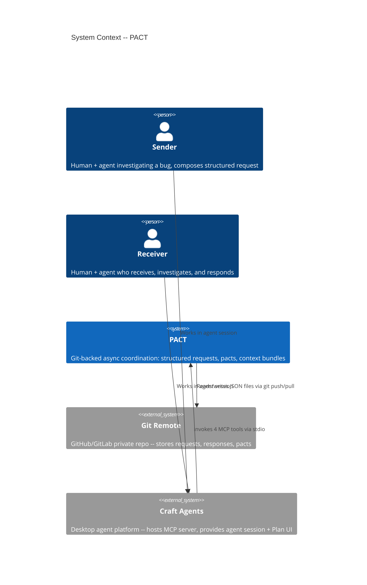
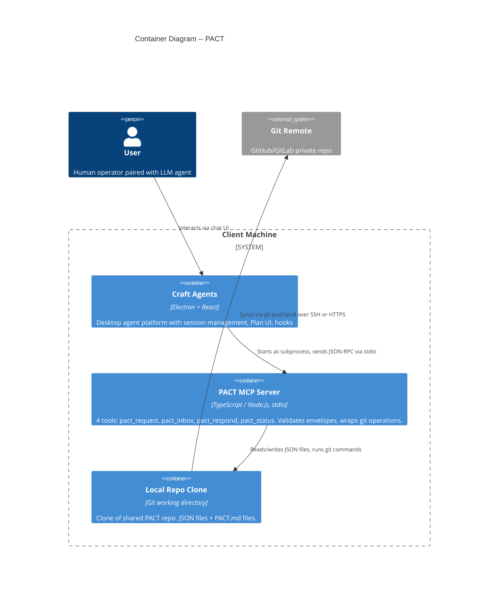

# Architecture Design -- PACT (Git-backed Agent Request Protocol)

## System Overview

A git-backed protocol for asynchronous human+agent coordination. JSON files in a shared git repository serve as the transport layer. A local MCP server on each client wraps git operations into 4 tools. PACT.md files define request type contracts. Both sides of a request use the same pact file.

**Architecture style**: Modular monolith (single MCP server process) with ports-and-adapters. The git repository is a driven adapter; the MCP protocol is a driving adapter.

**Tiered deployment**:

| Tier | What | When |
|------|------|------|
| Tier 1 | Git repo + local MCP server per client | MVP (this build) |
| Tier 2 | Brain service watching the repo (enrichment, notifications) | Post-MVP |
| Tier 3 | Institutional memory (indexing, pattern detection) | Future |

Each tier is additive. Tier 2 does not replace Tier 1 -- it watches the same repo and commits enrichment back. Clients never need to know whether a brain service is active.

---

## C4 System Context (Level 1)



### Context Narrative

Two users (Sender and Receiver) each work in Craft Agents sessions. When the Sender needs async help, their agent calls PACT tools exposed by a local MCP server. The MCP server writes structured JSON to a shared git repository and pushes. The Receiver's agent pulls the repo and finds the request in their inbox. After investigation, the Receiver's agent writes a structured response and pushes. The Sender checks status from any session at any time.

---

## C4 Container (Level 2)



### Container Responsibilities

**Craft Agents** (existing -- no changes to platform code):
- Hosts the MCP server as a stdio source
- Provides the agent session where users compose/review requests
- Plan submission UI for human review of requests and responses
- Hooks system for automated inbox polling (SchedulerTick)
- Loads PACT.md files from the local repo clone when referenced

**PACT MCP Server** (new -- the thing we build):
- Exposes 4 tools via MCP stdio protocol
- Validates request envelopes (required fields, recipient exists in config)
- Generates unique request IDs
- Manages git operations (pull, add, commit, push, mv)
- Handles git push conflicts with pull --rebase retry
- Returns structured JSON responses to the agent
- Stateless between tool calls -- all state lives in the repo

**Local Repo Clone** (convention -- not code):
- Working directory for the shared PACT repo
- Directory structure IS the protocol (requests/pending, completed, responses, pacts)
- JSON files are the data model
- git log is the audit trail

**Git Remote** (external -- GitHub/GitLab private repo):
- Central sync point for all clients
- Authentication via SSH keys or tokens (existing git config)
- Free hosting for small teams

---

## Component Architecture

The MCP server is small enough (~500 lines) that a C4 Level 3 diagram is unnecessary. The internal structure follows ports-and-adapters:

```
Driving side (inbound):
  MCP Protocol Handler (JSON-RPC over stdio)
    |
    v
  Tool Dispatcher (routes to tool handlers)
    |
    +-- pact_request handler
    +-- pact_inbox handler
    +-- pact_respond handler
    +-- pact_status handler
    |
    v
Driven side (outbound):
  Git Adapter (executes git commands on local repo)
  Config Reader (reads config.json for team membership)
  File I/O (reads/writes JSON request/response files)
```

### Port Definitions

**Driving port (MCP protocol)**:
- `pact_request(request_type, recipient, context_bundle, deadline?)` -- submit a request
- `pact_inbox()` -- list pending requests for current user
- `pact_respond(request_id, response_bundle)` -- respond to a request
- `pact_status(request_id)` -- check request status and response

**Driven ports (infrastructure)**:
- `GitPort`: pull, add, commit, push, mv, log
- `ConfigPort`: readTeamMembers, lookupUser
- `FilePort`: readJSON, writeJSON, listDirectory, moveFile

This separation allows testing the tool handlers against in-memory adapters without git, and allows future transport changes (HTTP instead of git) by swapping the driven adapter.

---

## Data Model

### Request Envelope (rigid -- validated by MCP server)

| Field | Type | Required | Source | Validation |
|-------|------|----------|--------|------------|
| `request_id` | string | yes | Generated | Format: `req-{YYYYMMDD}-{HHmmss}-{user_id}-{random4}` |
| `request_type` | string | yes | Agent input | Must match a `pacts/{type}/PACT.md` directory |
| `sender.user_id` | string | yes | `PACT_USER` env var | Must exist in config.json |
| `sender.display_name` | string | yes | config.json lookup | Resolved by MCP server |
| `recipient.user_id` | string | yes | Agent input | Must exist in config.json |
| `recipient.display_name` | string | yes | config.json lookup | Resolved by MCP server |
| `status` | string | yes | MCP server | Set to "pending" on create |
| `created_at` | ISO 8601 | yes | Generated | UTC timestamp |
| `deadline` | ISO 8601 | no | Agent input | Informational at Tier 1 |
| `context_bundle` | object | yes | Agent input | Not validated by server (flexible payload) |
| `expected_response` | object | no | Agent input | Guidance for receiver |

### Response Envelope

| Field | Type | Required | Source |
|-------|------|----------|--------|
| `request_id` | string | yes | From original request |
| `responder.user_id` | string | yes | `PACT_USER` env var |
| `responder.display_name` | string | yes | config.json lookup |
| `responded_at` | ISO 8601 | yes | Generated |
| `response_bundle` | object | yes | Agent input (flexible) |

### Team Configuration (config.json)

```json
{
  "team_name": "Acme Support",
  "version": 1,
  "members": [
    { "user_id": "cory", "display_name": "Cory" },
    { "user_id": "alex", "display_name": "Alex" }
  ]
}
```

---

## Git Repository Structure (The Protocol)

```
pact-repo/
  README.md                         # Protocol documentation (self-documenting repo)
  config.json                       # Team membership and settings

  requests/
    pending/                        # New requests awaiting response
      .gitkeep
      req-20260221-143022-cory-a1b2.json
    active/                         # Reserved for Tier 2 (brain acknowledges receipt)
      .gitkeep
    completed/                      # Responded requests (moved here by pact_respond)
      .gitkeep

  responses/
    .gitkeep
    req-20260221-143022-cory-a1b2.json   # Response keyed by request_id

  pacts/
    .gitkeep
    sanity-check/
      PACT.md                      # Single pact file, both sides
```

### Directory Semantics

| Directory | Meaning | Who writes | Who reads |
|-----------|---------|------------|-----------|
| `requests/pending/` | Awaiting response | pact_request | pact_inbox |
| `requests/active/` | Reserved for Tier 2 | (future brain) | (future) |
| `requests/completed/` | Response received | pact_respond (git mv) | pact_status |
| `responses/` | Response data | pact_respond | pact_status |
| `pacts/{type}/` | Request type contracts | Any team member | Agents on both sides |
| `config.json` | Team membership | Any team member | All tools (validation) |

### Request Lifecycle

```
[pact_request]          [pact_respond]
     |                        |
     v                        v
pending/ -----> (git mv) -----> completed/
                               + responses/{id}.json written
```

State transitions are directory moves (`git mv`), visible in `git log`.

---

## Technology Stack

| Component | Technology | License | Rationale |
|-----------|-----------|---------|-----------|
| MCP Server runtime | Node.js 20+ | MIT | Matches Craft Agents ecosystem (Bun/Node), stdio MCP support |
| MCP SDK | `@modelcontextprotocol/sdk` | MIT | Official MCP TypeScript SDK, already a Craft Agents dependency |
| Language | TypeScript | MIT (compiler) | Type safety for JSON schema handling, matches existing team expertise |
| Git operations | `simple-git` npm package | MIT | Mature, well-maintained git wrapper. Avoids raw child_process for reliability |
| JSON validation | Zod | MIT | Lightweight schema validation for request envelopes |
| Build | `tsup` or `esbuild` | MIT | Single-file bundle for stdio distribution |
| Package manager | Bun or npm | MIT | Bun preferred (matches Craft Agents), npm as fallback |

### Why Not Python?

The user has built MCP servers in both TypeScript and Python. TypeScript was chosen because:
1. Craft Agents is a TypeScript codebase -- pact and source conventions are TypeScript-native
2. `@modelcontextprotocol/sdk` (TypeScript) is the most mature MCP SDK
3. `simple-git` is a well-maintained npm package
4. Single-file bundling with esbuild/tsup produces a clean stdio entry point
5. Type safety for the rigid/flexible envelope schema benefits from TypeScript

---

## Integration Patterns

### Craft Agents Source Configuration

The PACT MCP server registers as a stdio source:

```json
{
  "id": "pact_{random}",
  "name": "PACT",
  "slug": "pact",
  "provider": "pact",
  "type": "mcp",
  "icon": "{mail-or-inbox-icon-url}",
  "tagline": "Agent-native async coordination with your team",
  "mcp": {
    "transport": "stdio",
    "command": "node",
    "args": ["{path-to-pact-mcp}/dist/index.js"],
    "env": {
      "PACT_REPO": "/absolute/path/to/local/pact-repo-clone",
      "PACT_USER": "cory"
    },
    "authType": "none"
  }
}
```

### Pact Auto-Loading

When `pact_inbox` returns a request, the response includes:
- The `request_type` field (e.g., "sanity-check")
- The `pact_path` field pointing to the local file: `{PACT_REPO}/pacts/{request_type}/PACT.md`

The agent reads the pact file from the local filesystem (the repo clone). No separate distribution mechanism needed -- git pull syncs pacts.

### Plan Submission Integration

Craft Agents already has `SubmitPlan` for human review. The PACT tools integrate naturally:

1. Agent composes request -> writes to temp file -> calls `SubmitPlan` -> user reviews/edits -> on approval, agent calls `pact_request`
2. Agent composes response -> writes to temp file -> calls `SubmitPlan` -> user reviews/edits -> on approval, agent calls `pact_respond`

The MCP server does not implement plan submission -- Craft Agents handles it. The PACT tools are downstream of the approval gate.

### Hooks Integration (Optional, Tier 1)

Automated inbox checking via Craft Agents SchedulerTick hook:

```json
{
  "SchedulerTick": [{
    "cron": "*/15 * * * *",
    "hooks": [{
      "type": "prompt",
      "prompt": "Check @pact inbox for new requests. If any exist, summarize them."
    }]
  }]
}
```

This creates a new session every 15 minutes to check the inbox. More sophisticated notification is deferred to Tier 2.

---

## Quality Attribute Strategies

### Reliability
- Git operations include pull-before-read and push-with-rebase-retry
- Append-only file design minimizes merge conflicts
- Network failure falls back to local state with staleness warning
- Single atomic commit for response + request move (prevents inconsistent state)

### Maintainability
- Ports-and-adapters allows swapping git for HTTP transport without changing tool logic
- Type-agnostic server -- new request types require only a new PACT.md, zero server changes
- MCP server is stateless -- all state in repo files

### Testability
- Driven ports (Git, Config, File) are interfaces that can be replaced with in-memory mocks
- Tool handlers can be unit tested without a real git repo
- Integration tests run against a local bare git repo (no network)

### Security
- Git authentication via SSH keys or tokens (existing user config)
- PACT_USER env var prevents sender spoofing (MCP server sets sender, not agent input)
- Craft Agents filters sensitive env vars from MCP subprocesses (existing behavior)
- Private repo = access control delegated to GitHub/GitLab

### Performance
- Git pull/push adds 1-5 seconds per operation (acceptable for async workflows)
- Inbox scan is a directory listing + JSON parse (sub-second for <100 pending requests)
- No database, no indexing -- file count is the scaling limit (hundreds of requests, not millions)

---

## Deployment Architecture

```
User A's Machine                    User B's Machine
+------------------+                +------------------+
| Craft Agents     |                | Craft Agents     |
|   |               |                |   |               |
|   +-- PACT MCP  |                |   +-- PACT MCP  |
|       |           |                |       |           |
|       +-- ~/repo |                |       +-- ~/repo |
+----------|-------+                +----------|-------+
           |                                   |
           +------ git push/pull ------+------+
                                       |
                                  [Git Remote]
                                  (GitHub/GitLab
                                   private repo)
```

- No server to deploy or maintain
- Each user clones the repo and configures the MCP source
- Zero infrastructure cost (GitHub private repos are free)
- Offline-capable (commit locally, push when network available)

---

## Request ID Generation

Format: `req-{YYYYMMDD}-{HHmmss}-{user_id}-{random4hex}`

Example: `req-20260221-143022-cory-a1b2`

**Why this format:**
- Date prefix enables chronological sorting and human readability
- User ID segment prevents collisions across clients even at same-second
- 4-hex random suffix handles the theoretical same-user-same-second edge case
- Short enough to reference in conversation ("the a1b2 request")
- Not content-addressed (unlike Beads) because requests are mutable (status changes via directory move)

---

## Git Authentication

The MCP server inherits git authentication from the user's existing environment:
- SSH keys configured in `~/.ssh/config`
- HTTPS credentials in git credential helper
- GitHub CLI (`gh auth`) tokens

No additional authentication mechanism is built. The target users are developers with git already configured. The MCP server simply runs `git push` and `git pull` -- if the user can push to the repo from their terminal, the MCP server can too.

---

## Error Handling

| Error | MCP Server Response | User Impact |
|-------|-------------------|-------------|
| Recipient not in config.json | Error: "Recipient '{id}' not found in team config" | Agent reports, user corrects |
| Missing required envelope field | Error: "Missing required field: {field}" | Agent retries with field |
| Pact directory does not exist | Error: "No pact found for request type '{type}'" | User creates pact first |
| Git push conflict | Auto: pull --rebase, retry once | Transparent to user |
| Git push conflict after retry | Error: "Push failed after retry. Run 'git status' in repo." | User resolves manually |
| Git pull network failure | Warning + stale local data | Agent notes staleness |
| Request already completed | Error: "Request {id} is already completed" | No duplicate response |
| Responder is not recipient | Error: "You are not the recipient of request {id}" | Only recipient can respond |
| Request not found | Error: "Request {id} not found in any directory" | Agent reports, user checks ID |

All errors return structured JSON with `error` field and human-readable `message`.

---

## Design Decisions Requiring ADRs

1. **ADR-001**: Git as PACT transport (over HTTP service)
2. **ADR-002**: Single PACT.md per request type (over paired sender/receiver files)
3. **ADR-003**: Local stdio MCP server (over centralized HTTP MCP)
4. **ADR-004**: TypeScript with simple-git (over Python, over raw child_process)
5. **ADR-005**: Directory-as-lifecycle (over status field mutation)
6. **ADR-006**: Request ID format (over UUID, over content-hash)

ADRs are in `/docs/adrs/`.

---

## Roadmap

### Walking Skeleton (US-001 + US-002 + US-003 + US-004 + US-005, integrated)

Build order follows the critical path: repo structure first, then tools in parallel, then integration test.

| Step | What | AC Count |
|------|------|----------|
| 1 | Repo template + config.json + pact stub | 5 (US-001) |
| 2 | MCP server scaffold (stdio, 4 tool stubs, env var loading) | 4 (US-007 partial) |
| 3 | pact_request (write JSON, validate envelope, git commit+push) | 5 (US-002) |
| 4 | pact_inbox (git pull, scan pending, filter by user, return summaries) | 5 (US-003) |
| 5 | pact_respond (write response, git mv to completed, atomic commit+push) | 5 (US-004) |
| 6 | pact_status (git pull, search directories, return status + response) | 5 (US-005) |
| 7 | Sanity-check PACT.md | 4 (US-006) |
| 8 | Craft Agents source config + round-trip test | 5 (US-007 + US-008) |

Steps 3-6 are parallelizable after step 2. Total estimated: 5-7 days.

---

## Handoff to Acceptance Designer

This architecture document, together with the 6 ADRs, provides:
- Component boundaries (MCP server, repo conventions, pact system)
- Technology stack with rationale
- Data model (request/response schemas, config schema)
- Integration points with Craft Agents (source config, Plan UI, hooks, pacts)
- Port definitions for test isolation
- Quality attribute strategies
- Unresolved decisions resolved (request ID format, git auth, pact auto-load, error handling)

The acceptance designer can now produce step-level acceptance tests for the 8-step roadmap.
