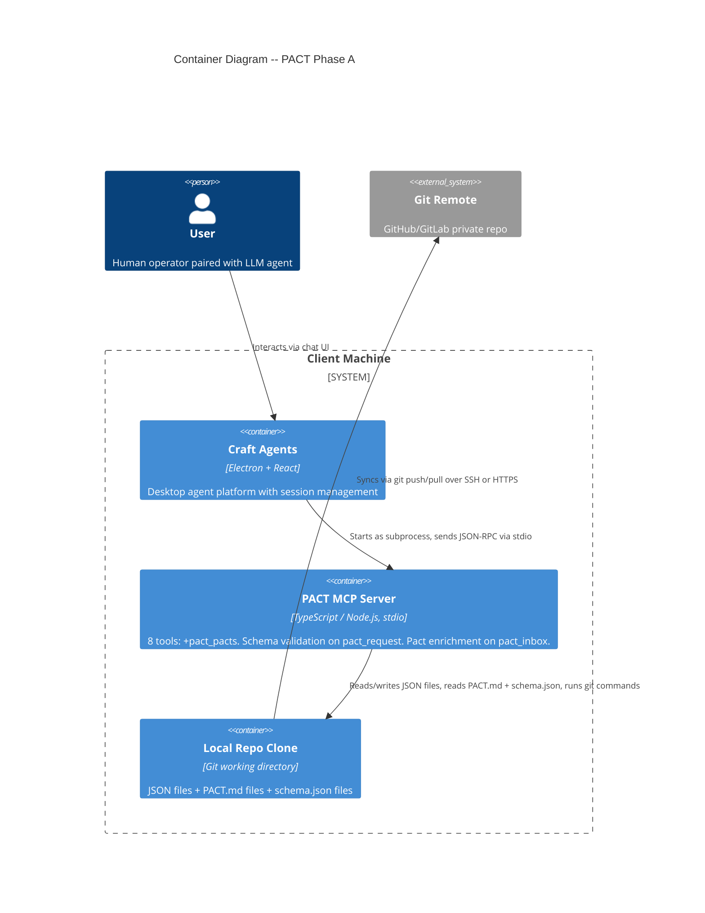
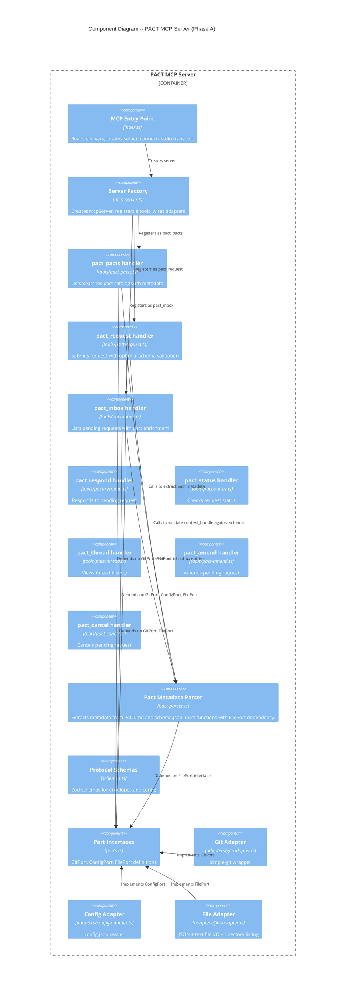

# Architecture Design -- PACT Phase A: Pact Discovery and Typed Contracts

## Scope

Phase A adds progressive pact discovery and machine-readable contracts to PACT. Three user stories: US-021 (schema.json convention), US-019 (pact_pacts tool), US-020 (inbox pact enrichment). This document extends the base architecture (`docs/architecture/architecture.md`) without replacing it.

**Net change**: 1 new application module, 1 new MCP tool, 2 modified tools, 2 extended interfaces, 4 schema.json files.

---

## C4 System Context (Level 1) -- Phase A

No change to system context. Phase A adds internal capabilities; the external system boundaries remain identical. Refer to the base architecture document for the L1 diagram.

---

## C4 Container (Level 2) -- Phase A



### Container Changes from Base Architecture

| Container | Change | Detail |
|-----------|--------|--------|
| PACT MCP Server | 7 tools becomes 8 tools | `pact_pacts` added |
| PACT MCP Server | pact_request gains validation | Warns on missing required fields when schema.json present |
| PACT MCP Server | pact_inbox gains enrichment | Adds pact_description and response_fields to entries |
| Local Repo Clone | New file convention | `pacts/{type}/schema.json` alongside existing PACT.md |

---

## C4 Component (Level 3) -- MCP Server Internal

The MCP server is growing from ~675 to ~850 estimated production lines. The addition of a shared pact-parser module and a new tool warrants a component diagram.



---

## Design Decision Resolutions

### D1: Where does shared pact parsing logic live?

**Decision**: New module `src/pact-parser.ts` at application core level.

**Rationale**: Pact parsing is application logic (interpreting markdown structure and JSON schema), not infrastructure. It consumes FilePort for I/O but belongs alongside `schemas.ts` and `ports.ts`, not behind a new port. This follows the existing pattern where tool handlers are application logic that depends on port interfaces.

**ADR**: ADR-010 (Pact Metadata Module)

**Behavioral contract**:
- Accepts FilePort + repoPath + pactName
- Returns structured metadata or undefined (never throws on missing/malformed files)
- Prefers schema.json for field extraction when available
- Falls back to PACT.md markdown parsing when schema.json absent
- Pure functions, no side effects beyond file reads

### D2: How is schema.json loaded and validated?

**Decision**: Via FilePort.readJSON and FilePort.fileExists. No new port.

**Rationale**: schema.json is a JSON file in the repo. FilePort already handles JSON reads. The pact-parser module calls `fileExists` to check for schema.json, then `readJSON` to load it. If schema.json is malformed or missing, the module returns undefined for schema-derived fields and falls back to PACT.md.

**ADR**: ADR-012 (FilePort readText and fileExists Extensions)

**FilePort extensions required**:
- `readText(path): Promise<string>` -- for reading PACT.md as markdown
- `fileExists(path): Promise<boolean>` -- for checking schema.json presence without throwing

### D3: How do validation warnings work in pact_request?

**Decision**: Add optional `validation_warnings: string[]` to the return type. Warnings are additive; existing return fields unchanged.

**Current return type**: `{ request_id, thread_id, status, message }`

**Phase A return type**: `{ request_id, thread_id, status, message, validation_warnings? }`

**Validation flow**:
1. After pact existence check (line 46-49 in pact-request.ts), call pact-parser to check for schema.json
2. If schema.json exists, extract `context_bundle.required` array
3. Compare required keys against submitted `context_bundle` keys
4. Missing keys become warning strings
5. Warnings array included in return only when non-empty
6. Request submits regardless of warnings

**Breaking change risk**: None. The return type gains an optional field. Existing consumers (agents parsing the JSON response) will not break -- they simply will not see `validation_warnings` when no warnings exist, which is indistinguishable from the current behavior.

**ADR**: ADR-011 (Schema Validation Strategy)

### D4: What does the pact_pacts tool look like?

**Decision**: New file at `src/tools/pact-pacts.ts` following the exact pattern of existing tool handlers.

**MCP registration**:
- Tool name: `pact_pacts`
- Description: "List available request types with descriptions and field information"
- Parameters: `{ query?: string }` -- optional keyword filter

**Handler signature**: `handlePactDiscover(params, ctx) -> Promise<PactsResult>`

**Context type**: `{ repoPath, git: GitPort, file: FilePort }` -- no ConfigPort needed (pacts are repo-level, not user-specific)

**Return shape**:
```
{
  pacts: [
    {
      name: string,
      description: string,
      when_to_use: string,
      context_fields: string[],
      response_fields: string[],
      pact_path: string,
      has_schema: boolean
    }
  ],
  warning?: string
}
```

**Behavioral rules**:
- Runs git pull before scanning (with fallback to local on failure, sets warning)
- Lists `pacts/` directory via FilePort
- For each subdirectory, calls pact-parser to extract metadata
- If `query` provided, filters by case-insensitive substring match against name + description + when_to_use
- Returns empty `pacts: []` array (not error) when no matches
- Pacts with missing or unreadable PACT.md are silently skipped

### D5: How does pact_inbox cache pact metadata?

**Decision**: In-memory `Map<string, PactMetadata>` scoped to a single `handlePactInbox` invocation.

**Rationale**: The inbox scan iterates over pending requests. Multiple requests may share the same `request_type`. Parsing the same PACT.md (and schema.json) for each duplicate type is wasteful. A per-invocation Map keyed by `request_type` eliminates redundant file reads.

**Scope**: The Map is a local variable inside `handlePactInbox`. It is created at function entry and garbage-collected when the function returns. No persistent state between tool calls. This preserves PACT's stateless-between-calls guarantee.

**Cache miss flow**: Call pact-parser, store result in Map, use result for enrichment.
**Cache hit flow**: Retrieve from Map, use for enrichment.
**Cache error flow**: If pact-parser returns undefined (missing pact), store `undefined` in Map. Subsequent requests of the same type skip enrichment without re-reading.

### D6: How does PACT.md parsing work?

**Decision**: Line-by-line parsing with section detection. Not regex-heavy.

**Parsing strategy**:

1. **Title**: First line starting with `# ` (H1). Strip the `# ` prefix.
2. **Description**: Content between H1 and first H2, excluding blank lines. Join into single string.
3. **When To Use**: Content under `## When To Use` section until next H2. Strip list markers (`- `).
4. **Context fields**: Content under `## Context Bundle Fields` section. Find markdown table rows (lines containing `|`). Extract first column after header separator (`|---|`). Strip whitespace.
5. **Response fields**: Same algorithm applied to `## Response Structure` section.

**Error tolerance**:
- Missing sections return empty string or empty array (not error)
- Malformed tables return empty field arrays
- Files that cannot be read return undefined for the entire metadata object
- Extra sections (Worked Example, How Rounds Work) are ignored

**Validation against existing pacts**: The 4 existing PACT.md files (ask, sanity-check, code-review, design-pact) all follow this structure consistently. The parsing algorithm is designed against these concrete examples.

### D7: schema.json validation scope

**Decision**: Key-presence-only validation for Phase A. No type checking, no nested validation.

**ADR**: ADR-011 (Schema Validation Strategy)

**What is validated**: Are all keys listed in `context_bundle.required` present as keys in the submitted `context_bundle`?

**What is NOT validated**: Field value types, nested object structure, array item schemas, pattern matching, conditional requirements.

**Rationale**: The requirements specify key-presence-only. Full JSON Schema validation (via ajv) would add a runtime dependency for marginal Phase A benefit. Phase B can upgrade if type validation proves necessary.

---

## Data Flow Diagrams

### Flow 1: pact_pacts (US-019)

```
Agent                    pact_pacts handler        pact-parser          FilePort        GitPort
  |                            |                        |                    |               |
  |-- pact_pacts(query?) ---->|                        |                    |               |
  |                            |-- pull() ------------->|                    |               |
  |                            |                        |                    |          pull remote
  |                            |-- listDirectory("pacts/") --------------->|               |
  |                            |<-- ["ask","code-review","sanity-check",...] |               |
  |                            |                        |                    |               |
  |                            |  for each pact:       |                    |               |
  |                            |-- parsePactMetadata -->|                    |               |
  |                            |                        |-- fileExists(schema.json) ------->|
  |                            |                        |<-- true/false -----|               |
  |                            |                        |-- readJSON or readText ---------->|
  |                            |                        |<-- file content ---|               |
  |                            |                        |-- (parse content)  |               |
  |                            |<-- PactMetadata ------|                    |               |
  |                            |                        |                    |               |
  |                            |  if query: filter by substring match       |               |
  |                            |                        |                    |               |
  |<-- { pacts: [...] } ------|                        |                    |               |
```

### Flow 2: pact_request with schema validation (US-021)

```
Agent                    pact_request handler       pact-parser          FilePort        GitPort
  |                            |                        |                    |               |
  |-- pact_request(params) --->|                        |                    |               |
  |                            |  validate params       |                    |               |
  |                            |  check pact exists    |                    |               |
  |                            |  validate recipient    |                    |               |
  |                            |                        |                    |               |
  |                            |-- loadSchemaValidation(type) ------------->|               |
  |                            |                        |-- fileExists(schema.json) ------->|
  |                            |                        |<-- true ----------|               |
  |                            |                        |-- readJSON(schema.json) --------->|
  |                            |                        |<-- schema object --|               |
  |                            |<-- required fields ----|                    |               |
  |                            |                        |                    |               |
  |                            |  compare required vs context_bundle keys   |               |
  |                            |  missing = warnings    |                    |               |
  |                            |                        |                    |               |
  |                            |  build envelope        |                    |               |
  |                            |  write + commit + push |                    |               |
  |                            |                        |                    |               |
  |<-- { request_id, ...,      |                        |                    |               |
  |      validation_warnings } |                        |                    |               |
```

### Flow 3: pact_inbox with pact enrichment (US-020)

```
Agent                    pact_inbox handler         pact-parser          FilePort        GitPort
  |                            |                        |                    |               |
  |-- pact_inbox() ----------->|                        |                    |               |
  |                            |-- pull() ------------->|                    |          pull remote
  |                            |-- listDirectory("requests/pending") ------>|               |
  |                            |<-- [file1, file2, ...] |                    |               |
  |                            |                        |                    |               |
  |                            |  for each file:        |                    |               |
  |                            |    read + parse envelope                    |               |
  |                            |    filter by recipient                      |               |
  |                            |    build InboxEntry                         |               |
  |                            |                        |                    |               |
  |                            |  pact metadata cache = Map<string, PactMetadata?>        |
  |                            |                        |                    |               |
  |                            |  for each entry:       |                    |               |
  |                            |    if cache miss:      |                    |               |
  |                            |-- parsePactMetadata -->|                    |               |
  |                            |                        |-- (read files) --->|               |
  |                            |<-- metadata or undef --|                    |               |
  |                            |    store in cache      |                    |               |
  |                            |    if metadata:        |                    |               |
  |                            |      entry.pact_description = metadata.description        |
  |                            |      entry.response_fields = metadata.responseFields       |
  |                            |                        |                    |               |
  |                            |  group by thread_id (existing logic)        |               |
  |                            |  sort by created_at    |                    |               |
  |                            |                        |                    |               |
  |<-- { requests: [...] } ----|                        |                    |               |
```

---

## Interface Definitions

### FilePort Extensions (ADR-012)

Current FilePort gains two methods:

```
FilePort:
  readJSON<T>(path) -> Promise<T>         # existing
  writeJSON(path, data) -> Promise<void>   # existing
  writeText(path, content) -> Promise<void># existing
  readText(path) -> Promise<string>        # NEW -- reads file as UTF-8 text
  listDirectory(path) -> Promise<string[]> # existing
  moveFile(from, to) -> Promise<void>      # existing
  fileExists(path) -> Promise<boolean>     # NEW -- checks file existence
```

### Pact Metadata Types

The pact-parser module works with these data shapes:

```
PactMetadata:
  name: string                    # directory name (e.g., "sanity-check")
  description: string             # first paragraph from PACT.md
  when_to_use: string             # content of "When To Use" section
  context_fields: string[]        # field names from Context Bundle Fields table or schema.json
  response_fields: string[]       # field names from Response Structure table or schema.json
  has_schema: boolean             # whether schema.json exists for this pact
  pact_path: string              # absolute path to PACT.md

PactSchema:                      # parsed from schema.json
  pact_name: string
  pact_version: string
  context_bundle:
    required: string[]
    properties: Record<string, { type, description }>
  response_bundle:
    required: string[]
    properties: Record<string, { type, description }>
```

### InboxEntry Extensions (US-020)

```
InboxEntry:
  request_id: string              # existing
  short_id: string                # existing
  thread_id?: string              # existing
  request_type: string            # existing
  sender: string                  # existing
  created_at: string              # existing
  summary: string                 # existing
  pact_path: string              # existing
  attachment_count: number        # existing
  amendment_count: number         # existing
  attachments?: [...]             # existing
  pact_description?: string      # NEW -- from pact-parser, omitted if pact missing
  response_fields?: string[]      # NEW -- from pact-parser, omitted if pact missing

InboxThreadGroup:
  # all existing fields...
  pact_description?: string      # NEW -- from latest entry's pact
  response_fields?: string[]      # NEW -- from latest entry's pact
```

### pact_request Return Type Extension (US-021)

```
PactRequestResult:
  request_id: string              # existing
  thread_id: string               # existing
  status: string                  # existing
  message: string                 # existing
  validation_warnings?: string[]  # NEW -- present only when warnings exist
```

---

## schema.json Convention

### File Location

`pacts/{type}/schema.json` -- alongside PACT.md in the same directory.

### File Format

JSON Schema draft 2020-12 with PACT-specific top-level fields:

```
{
  "$schema": "https://json-schema.org/draft/2020-12/schema",
  "pact_name": "{type}",
  "pact_version": "1.0.0",
  "context_bundle": {
    "type": "object",
    "required": [...],
    "properties": { ... },
    "additionalProperties": true
  },
  "response_bundle": {
    "type": "object",
    "required": [...],
    "properties": { ... },
    "additionalProperties": true
  }
}
```

### Critical Design Properties

- `additionalProperties: true` on both bundles -- required fields enforced, creative extension allowed
- `required` array defines the minimum contract; properties beyond required are documented but not enforced
- schema.json is optional -- pacts without it work identically to today
- PACT.md remains the authoritative human-readable documentation; schema.json is the machine-readable companion

### Pacts to Receive schema.json

All 4 existing pacts: ask, code-review, sanity-check, design-pact. Authored manually to match their PACT.md field tables.

---

## Technology Stack -- Phase A Additions

| Component | Technology | License | Rationale |
|-----------|-----------|---------|-----------|
| Schema validation | Plain TypeScript (key-presence check) | N/A | Zero new deps. Required field presence check is trivial. ADR-011. |
| PACT.md parsing | Plain TypeScript (line-by-line) | N/A | Zero new deps. Section detection + table extraction. No regex library needed. |
| schema.json format | JSON Schema draft 2020-12 | N/A (specification) | Industry standard. Human-readable. Tool ecosystem available if needed later. |

**No new runtime dependencies.** Phase A uses only existing deps: `@modelcontextprotocol/sdk`, `simple-git`, `zod`.

---

## Dependency Graph -- New and Modified Files

```
src/ports.ts                  MODIFIED  -- add readText, fileExists to FilePort
src/pact-parser.ts           NEW       -- shared pact metadata extraction
src/tools/pact-pacts.ts      NEW       -- pact_pacts tool handler
src/tools/pact-request.ts     MODIFIED  -- add schema validation warnings
src/tools/pact-inbox.ts       MODIFIED  -- add pact enrichment with cache
src/adapters/file-adapter.ts  MODIFIED  -- implement readText, fileExists
src/mcp-server.ts             MODIFIED  -- register pact_pacts, import handler

pacts/ask/schema.json              NEW  -- typed contract
pacts/code-review/schema.json      NEW  -- typed contract
pacts/sanity-check/schema.json     NEW  -- typed contract
pacts/design-pact/schema.json     NEW  -- typed contract
```

### Dependency Direction (ports-and-adapters compliance)

```
                  DRIVING SIDE
                       |
              MCP Protocol (stdio)
                       |
                  mcp-server.ts
                   /   |   \
     pact-pacts.ts  pact-request.ts  pact-inbox.ts
           \            |            /
            +--- pact-parser.ts ---+
                       |
                    ports.ts (interfaces)
                       |
                  DRIVEN SIDE
                   /   |   \
        git-adapter  config-adapter  file-adapter
```

All dependencies point inward. Tool handlers and pact-parser depend on port interfaces, never on adapter implementations. Adapters implement port interfaces. No circular dependencies.

---

## Phase B Readiness Assessment

Phase A artifacts feed directly into Phase B (meta-tool architecture) with zero throwaway:

| Phase A Artifact | Phase B Usage |
|-----------------|---------------|
| `pact-parser.ts` module | Becomes the parsing engine behind `pact_discover` meta-tool's pact search |
| `schema.json` files | Input for typed SDK generation (TypeScript interfaces from JSON Schema) |
| `pact_pacts` handler logic | Reused inside `pact_discover` when the query targets pacts |
| `FilePort.readText` | Required by any future module reading markdown files |
| `FilePort.fileExists` | Required by any future module checking for optional files |
| Key-presence validation | Extensible to full type validation (add ajv) when Phase B justifies the dependency |
| `PactMetadata` type | Becomes the return type for Phase B SDK's `pacts.list()` and `pacts.get()` methods |

### Phase B does NOT require rework of Phase A because:

1. `pact_pacts` stays as a standalone MCP tool (backward compatible with non-code-mode agents) while also serving as the implementation behind `pact_discover`
2. `schema.json` is the same format Phase B's SDK generator consumes -- no format migration
3. The pact-parser module is pure functions with dependency injection -- Phase B's `pact_discover` simply calls the same functions
4. Inbox enrichment is independently valuable regardless of whether Phase B ships

---

## Quality Attribute Strategies -- Phase A Specific

### Reliability

- schema.json reading failures silently skip validation (no degradation to existing flow)
- Pact metadata parsing failures silently omit enrichment fields (inbox still works)
- git pull failures in pact_pacts fall back to local data with warning (same pattern as pact_inbox)

### Maintainability

- Shared pact-parser prevents logic duplication across 3 consumers
- schema.json is optional -- adding pacts does not require schema authoring
- Phase A is purely additive: removing it restores exact pre-Phase-A behavior

### Testability

- pact-parser is pure functions with FilePort injection -- test with in-memory doubles
- Schema validation is a separate concern from envelope creation -- testable in isolation
- Inbox enrichment cache is a local variable -- no test setup needed for cache state

### Performance

- Pact metadata cache in inbox prevents redundant file reads (O(unique types) reads, not O(requests))
- pact_pacts scans pacts/ directory once per invocation (4-100 directories, sub-second)
- schema.json files are small (~1KB each) -- readJSON is fast

---

## Roadmap

### Recommended Build Order

Build order follows dependency graph and recommended order from backlog:

| Step | Story | What | Files Changed | Est. Lines |
|------|-------|------|---------------|------------|
| 1 | US-021 | FilePort extensions (readText, fileExists) | ports.ts, file-adapter.ts | ~15 |
| 2 | US-021 | schema.json files for 4 existing pacts | 4 new schema.json files | ~200 |
| 3 | US-021 | Pact-parser module (schema.json reading + PACT.md parsing) | pact-parser.ts (new) | ~80-120 |
| 4 | US-021 | Schema validation in pact_request | pact-request.ts | ~20-30 |
| 5 | US-019 | pact_pacts tool handler | pact-pacts.ts (new), mcp-server.ts | ~80-100 |
| 6 | US-020 | Inbox pact enrichment with cache | pact-inbox.ts | ~30-40 |

Steps 1-4 are US-021 (foundation). Step 5 is US-019 (new tool). Step 6 is US-020 (enrichment).

Steps 5 and 6 both depend on step 3 (pact-parser). Steps 5 and 6 are independent of each other.

**Estimated total production lines added**: ~225-305 (from ~675 to ~900-980).

---

## ADR Index -- Phase A

| ADR | Title | Decision |
|-----|-------|----------|
| ADR-010 | Pact Metadata Module | Shared `src/pact-parser.ts` at application core, pure functions with FilePort dependency |
| ADR-011 | Schema Validation Strategy | Key-presence-only validation using plain TypeScript. No ajv. WARN not REJECT. |
| ADR-012 | FilePort Extensions | Add `readText(path)` and `fileExists(path)` to FilePort interface |

---

## Handoff to Acceptance Designer

This architecture document provides:

- Component boundaries: pact-parser as shared module, pact_pacts as new tool, pact_request/pact_inbox modifications
- Interface contracts: FilePort extensions, PactMetadata type, return type changes, schema.json format
- Data flows: sequence diagrams for all three stories
- Technology decisions: no new deps, key-presence validation, line-by-line parsing
- Integration points: pact-parser consumed by three tool handlers
- Phase B readiness: every Phase A artifact feeds forward

The acceptance designer can produce step-level acceptance tests for the 6-step roadmap using the behavioral contracts, data flows, and interface definitions above. Implementation decisions (class decomposition, method signatures, internal algorithms) are deferred to the software crafter.
