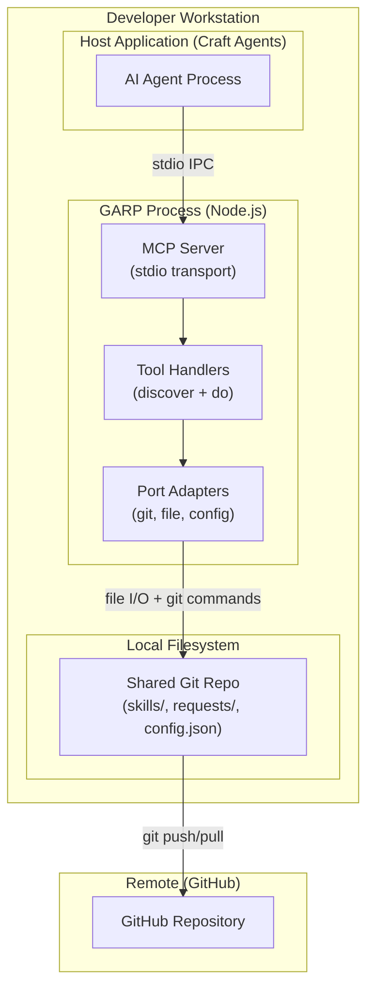

# Platform Architecture: Collapsed Tools + Declarative Brain

**Feature**: collapsed-tools-brain
**Date**: 2026-02-22
**Author**: Apex (nw-platform-architect)
**Status**: Draft

---

## 1. System Overview

GARP is a local MCP server deployed as a Node.js process that communicates via stdio transport. It is not a cloud-deployed service, containerized application, or web service. It runs on developer workstations and is installed from source (git clone + npm/bun install).

### Deployment Target

- **Environment**: Local developer workstation
- **Runtime**: Node.js >=20.0.0
- **Installation Method**: Git clone + `npm install` or `bun install`
- **Distribution**: Published via git repository (no npm registry, no container registry)
- **Execution**: Invoked as MCP server by host applications (Craft Agents, Claude Desktop, etc.)

### Key Constraints

1. **No cloud infrastructure** - This is a localhost-only process
2. **No containers** - Runs directly on the host OS via Node.js
3. **No deployment orchestration** - Users install/update manually via git pull
4. **No distributed systems concerns** - Single-process, single-user, single-machine
5. **No observability stack** - Structured logging to stderr is sufficient

---

## 2. Platform Architecture Diagram



---

## 3. Deployment Topology

### Single-Process Architecture

GARP is a **single TypeScript process** with no sidecars, background workers, or external services. All functionality runs in one Node.js process that:

- Accepts MCP requests via stdin
- Writes MCP responses to stdout
- Logs diagnostics to stderr (structured JSON)
- Performs git operations via `simple-git` library
- Reads/writes files directly to the local filesystem

### No Horizontal Scaling

GARP is a single-user tool. Each developer runs their own isolated instance. There is no concept of load balancing, request distribution, or shared state across instances.

### No Service Discovery

The host application (Craft Agents) invokes GARP as a subprocess and communicates via stdio. No network ports, no service mesh, no DNS resolution.

---

## 4. Installation and Update Process

### Initial Installation

```bash
# Developer clones the repository
git clone https://github.com/coryetzkorn/garp.git
cd garp

# Install dependencies
npm install  # or: bun install

# Build the distribution bundle
npm run build  # or: bun run build

# Verify build artifact exists
test -f dist/index.js && echo "Build successful"
```

### Configuration for MCP Hosts

Developers configure their MCP host (e.g., Craft Agents) to invoke GARP as a subprocess:

```json
{
  "mcpServers": {
    "garp": {
      "command": "node",
      "args": ["/path/to/garp/dist/index.js"],
      "cwd": "/path/to/shared/repo"
    }
  }
}
```

The `cwd` parameter determines which shared git repository GARP operates on.

### Update Process

```bash
# Developer pulls latest code
cd /path/to/garp
git pull origin main

# Rebuild
npm run build

# Restart MCP host application to load new version
# (No hot reload, no zero-downtime deployment)
```

Updates are manual. Developers choose when to update by pulling from git and rebuilding.

---

## 5. Dependencies and External Services

### Runtime Dependencies

| Dependency | Version | Purpose | Source |
|------------|---------|---------|--------|
| Node.js | >=20.0.0 | Runtime engine | Installed by developer via package manager |
| `@modelcontextprotocol/sdk` | ^1.24.3 | MCP protocol implementation | npm registry |
| `simple-git` | ^3.32.1 | Git operations | npm registry |
| `zod` | ^4.0.0 | Schema validation | npm registry |
| `yaml` | ^2.x | YAML frontmatter parsing | npm registry (new for this feature) |

### External Services

| Service | Purpose | Required? |
|---------|---------|-----------|
| GitHub | Remote git storage, synchronization | Yes (for multi-developer teams) |
| npm registry | Dependency resolution during installation | Yes (during install only) |

GARP can operate offline after initial installation, but git push/pull require network access to GitHub.

---

## 6. Build Artifacts

### Compilation Process

GARP uses **esbuild** (invoked via `build.ts` script) to produce a single ESM bundle:

- **Input**: `src/index.ts` (entry point) + all imported modules
- **Output**: `dist/index.js` (single-file bundle)
- **Bundling strategy**: All application code bundled; dependencies marked `external` (resolved from node_modules at runtime)
- **Target**: Node.js 20 ESM

### Artifact Structure

```
dist/
  index.js      -- Single-file ESM bundle (all application code)

node_modules/   -- Runtime dependencies (not bundled, required at runtime)

package.json    -- Dependency manifest
```

The `dist/index.js` file is the only artifact needed for execution, but `node_modules/` must be present to resolve external dependencies.

---

## 7. Data Storage and State Management

### Filesystem as Database

GARP uses the local filesystem as its persistent store. There is no database server, no object storage service, no external data tier.

```
<shared-repo>/
  skills/               -- Skill contracts (SKILL.md per directory)
  requests/
    pending/            -- Active requests
    completed/          -- Responded requests
    cancelled/          -- Cancelled requests
  responses/            -- Response envelopes
  attachments/          -- File attachments
  config.json           -- Team configuration
  .git/                 -- Git repository metadata
```

All data operations are file I/O. Git provides versioning, synchronization, and concurrency control.

### State Synchronization

Multiple developers share state by pushing/pulling to/from the same git repository. GARP executes `git pull` before reads and `git push` after writes to maintain consistency.

### No Database Migrations

Schema changes are handled by modifying file structures. There are no database migrations, schema versioning, or backward compatibility layers. The git repository itself is the schema.

---

## 8. Security and Permissions

### Execution Context

GARP runs with the permissions of the user who invoked the host application (Craft Agents). It has:

- **File system access**: Read/write to any path the user can access
- **Network access**: Git operations over HTTPS (GitHub)
- **No authentication boundary**: GARP trusts the host application completely

### Secrets Management

GARP does not store secrets. Git credentials are managed by the developer's local git configuration (credential helper, SSH keys, etc.). No API keys, no tokens, no encrypted stores.

### Isolation

Each developer's GARP instance is isolated to their local machine. Shared state is mediated through git commits. There is no shared memory, no network communication between instances.

---

## 9. Logging and Diagnostics

### Structured Logging to stderr

GARP writes JSON-formatted log entries to stderr. The host application captures these logs. No log aggregation service, no centralized logging.

Log format:

```json
{
  "timestamp": "2026-02-22T10:30:00.000Z",
  "level": "info",
  "message": "Tool invoked",
  "tool": "garp_do",
  "action": "send",
  "request_id": "req_20260222_103000_abc123"
}
```

Levels: `debug`, `info`, `warn`, `error`.

### No Distributed Tracing

GARP is a single-process local tool. There are no distributed traces, no trace IDs, no span propagation. The request/response model is synchronous within the MCP stdio channel.

### Debugging

Developers debug GARP by:

1. Reading stderr logs from the host application
2. Examining the shared git repository filesystem
3. Running acceptance tests locally
4. Attaching a Node.js debugger to the GARP process

---

## 10. Migration Architecture (Feature-Specific)

### Parallel Tool Registration (Phase 1)

During Phase 1, GARP registers **10 MCP tools** simultaneously:

- 8 legacy tools: `garp_request`, `garp_inbox`, `garp_respond`, `garp_status`, `garp_thread`, `garp_cancel`, `garp_amend`, `garp_skills`
- 2 new tools: `garp_discover`, `garp_do`

Both surfaces invoke the same handler modules. There is no separate code path, no feature flag runtime. The parallel registration is purely at the MCP registration layer.

### Behavioral Equivalence Testing (Phase 2)

Acceptance tests validate that both surfaces produce identical outcomes:

- Same handler logic executed
- Same git commits written
- Same file structures created
- Same response shapes returned

### Tool Removal (Phase 3)

After equivalence is proven, the 8 legacy tool registrations are deleted from `src/mcp-server.ts`. The handler modules (`garp-request.ts`, `garp-inbox.ts`, etc.) remain unchanged; only the MCP surface changes.

---

## 11. Future Evolution: Brain Processing Layer

The brain processing layer (validation, enrichment, routing, auto-response) is defined in this feature's data model but not implemented. Future implementation options:

### Option 1: In-Process Brain

Add a brain execution module to the GARP process. The brain reads `brain_processing` rules from SKILL.md and executes them synchronously during request handling.

- **Pros**: Simple, no new infrastructure
- **Cons**: Brain execution blocks the MCP request

### Option 2: Git Hook Brain

Implement the brain as a git server-side hook (GitHub Actions workflow triggered on push to `requests/pending/`).

- **Pros**: Asynchronous, doesn't block MCP requests
- **Cons**: Requires GitHub Actions setup, adds latency

### Option 3: Serverless Brain Function

Deploy the brain as a serverless function (AWS Lambda, Cloudflare Workers) triggered by GitHub webhooks.

- **Pros**: Scalable, event-driven
- **Cons**: Adds cloud infrastructure dependency

**Recommendation for Phase 1**: No brain implementation. Skill contracts include `brain_processing` sections, but GARP ignores them. Brain implementation is a separate feature wave.

---

## 12. Platform Alignment Summary

| Requirement | Solution | Notes |
|-------------|----------|-------|
| Deployment Target | Local developer workstation | No cloud deployment |
| Container Orchestration | None | Bare Node.js process |
| CI/CD Platform | GitHub Actions | Existing `.github/workflows/ci.yml` |
| Existing Infrastructure | Extend ci.yml only | No new infrastructure |
| Observability | Structured logging to stderr | No external monitoring |
| Deployment Strategy | Recreate (manual git pull + rebuild) | No zero-downtime concerns |
| Continuous Learning | Not applicable | Local dev tool |
| Branching Strategy | Trunk-based development | Single `main` branch, PR gates |

This platform architecture reflects the reality that GARP is a local development tool, not a production service.
