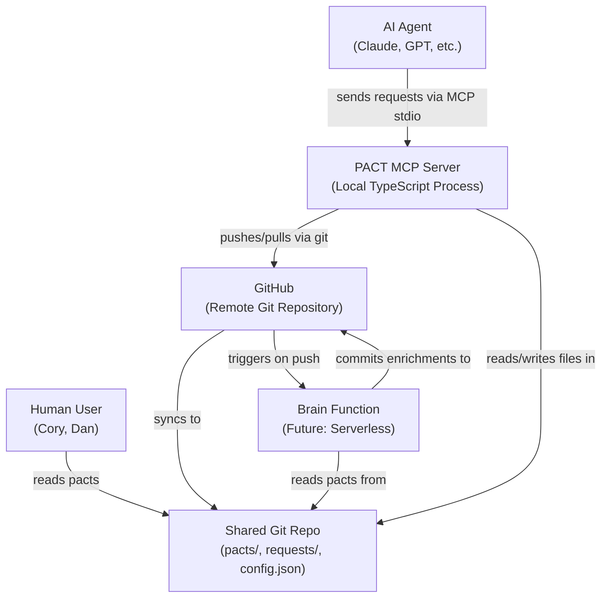
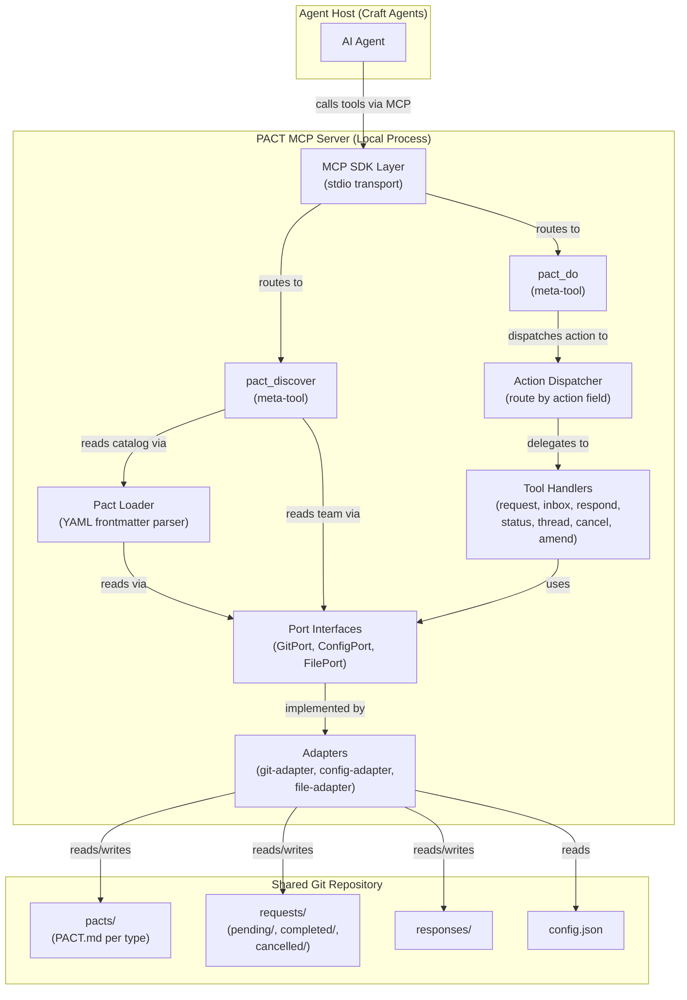
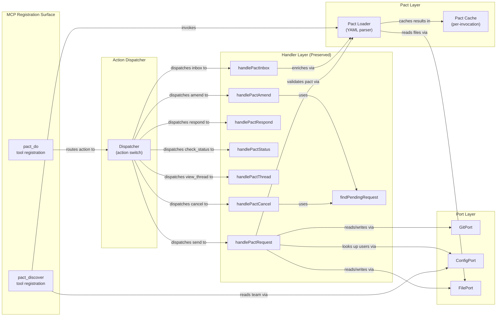

# Architecture Design: Collapsed Tools + Declarative Brain

**Feature**: collapsed-tools-brain
**Date**: 2026-02-22
**Author**: Morgan (nw-solution-architect)
**Status**: Draft

---

## 1. System Overview

PACT collapses from 8 enumerated MCP tools to 2 meta-tools (`pact_discover` and `pact_do`) while introducing a unified pact format that serves agents, humans, and a future brain processing layer. The internal handler logic, protocol schemas, ports-and-adapters architecture, and git transport remain unchanged.

### Before (8 tools, O(tools + pacts) context cost)

```
Agent context loads: pact_request, pact_inbox, pact_respond, pact_status,
pact_thread, pact_cancel, pact_amend, pact_pacts
= 8 tool descriptions x ~200 tokens = ~1,600 tokens baseline
+ pact listing grows linearly with pact count
```

### After (2 tools, O(1) context cost)

```
Agent context loads: pact_discover, pact_do
= 2 tool descriptions x ~200 tokens = ~400 tokens baseline
Pacts discovered on-demand, not enumerated at startup
```

The handler modules (`pact-request.ts`, `pact-inbox.ts`, etc.) are preserved as internal dispatch targets. The collapse happens at the MCP registration surface only.

---

## 2. Design Decisions

### DD-1: Two Meta-Tools (discover + do)

**Decision**: Collapse to exactly 2 MCP tools.

- **`pact_discover`** -- Read-only discovery. Returns pacts, team members, thread history. No side effects.
- **`pact_do`** -- Write/read operations. Accepts an `action` discriminator that dispatches to the appropriate handler.

**Rationale**: A 2-tool split along the read-discovery / do-action boundary provides the clearest mental model. Three tools (discover + read + write) over-segments reads (inbox, status, thread are "reads" but behaviorally different from discovery). The discover/do split maps cleanly to "what can I do?" vs "do this."

**Rejected alternative**: 3 tools (discover + read + write). Splitting reads from writes creates ambiguity -- is "check inbox" a read or a discovery? Adds a third tool description to context for minimal conceptual gain.

**Rejected alternative**: 1 tool (pact). A single uber-tool makes the description too long and loses the semantic benefit of the discover/do split.

### DD-2: Action Discriminator in pact_do

**Decision**: `pact_do` accepts an `action` string field as the first-level discriminator. Valid actions: `send`, `respond`, `cancel`, `amend`, `check_status`, `inbox`, `view_thread`.

Each action maps 1:1 to an existing handler module. The action field is validated before dispatch; unknown actions produce an error.

**Rationale**: A string discriminator is simpler than nested objects or polymorphic schemas. Agents can discover valid actions via `pact_discover`. The 1:1 mapping to existing handlers preserves all current behavior and test contracts.

**Note**: `inbox` and `check_status` and `view_thread` are read operations placed in `pact_do` rather than `pact_discover` because they operate on live request state (pulling from git, scanning directories). Discovery returns catalog/reference data that changes infrequently.

### DD-3: pact_discover Response Shape

**Decision**: `pact_discover` accepts an optional `query` parameter and returns a structured catalog with three sections: `pacts`, `team`, and `threads`.

- **`pacts`** array: Each entry includes `name`, `description`, `when_to_use`, `context_fields` (names + required flag), `response_fields` (names). Parsed deterministically from YAML frontmatter in PACT.md.
- **`team`** array: Each entry includes `user_id` and `display_name`. Read from config.json.
- **`threads`** array: Active thread summaries for the current user. Optional, included when the agent needs conversation context.

The `query` parameter filters pacts by keyword match against name, description, and when_to_use text.

**Rationale**: Returning all three categories in one call gives the agent everything it needs to compose a `pact_do` action in a single round-trip. The response is compact because field definitions are names + required flags, not full JSON Schema.

### DD-4: YAML Frontmatter + Markdown Body (Single File)

**Decision**: Replace PACT.md (heuristic markdown) + schema.json (separate file) with a single PACT.md file that uses YAML frontmatter for machine-parseable metadata and a markdown body for human-readable documentation.

The YAML frontmatter contains: name, version, description, when_to_use, context_bundle schema, response_bundle schema, and optional hooks rules.

The markdown body contains: workflow documentation, examples, multi-round patterns -- anything that helps humans understand the pact.

**Rationale**: A single file eliminates the sync problem between PACT.md and schema.json. YAML frontmatter is a well-established pattern (Jekyll, Hugo, Docusaurus, Astro). Deterministic YAML parsing replaces heuristic regex-based markdown table extraction (the 63% mutation score problem). The markdown body preserves human readability.

**Rejected alternative**: Pure YAML/JSON file. Loses human readability. Pacts need to be comfortable for non-technical team members to read.

**Rejected alternative**: Keep PACT.md + schema.json as separate files. The sync problem is real -- if description changes in PACT.md but not schema.json, which is authoritative? Single file, single truth.

### DD-5: Brain Processing as Optional YAML Section

**Decision**: Brain processing rules live in the YAML frontmatter of PACT.md under a `hooks` key. This section is entirely optional -- pacts without it behave exactly as they do today (dumb routing).

The brain pipeline has four stages executed in order: `validation`, `enrichment`, `routing`, `auto_response`.

**Rationale**: Co-locating brain rules with the pact ensures the brain reads the same source of truth as agents and humans. No separate brain config directory, no config drift. Pacts opt into brain processing by adding the section; pacts without it are unaffected.

### DD-6: Brain Pipeline Stage Model

**Decision**: Four stages, executed in order. Each stage is optional.

1. **validation** -- Check request content beyond key-presence. Produces warnings (WARN not REJECT, consistent with existing pattern).
2. **enrichment** -- Add computed fields to the request envelope. Written back via the amendment mechanism (append-only, existing pattern).
3. **routing** -- Override or supplement recipient routing. May reassign, cc, or escalate.
4. **auto_response** -- Generate automatic responses for requests that match conditions. Template-based, with variable substitution from request fields.

**Rationale**: This is the natural pipeline for request processing. Validation must precede enrichment (no point enriching invalid requests). Enrichment must precede routing (routing may depend on enriched data). Auto-response is the terminal action.

### DD-7: Condition Evaluation -- Declarative Key-Value Matching

**Decision**: Brain rule conditions use declarative key-value matching with a small set of operators: `equals`, `contains`, `in`, `exists`, `gt`, `lt`. Conditions reference fields in the request envelope or context_bundle using dot-notation paths (e.g., `context_bundle.urgency`).

Multiple conditions in a rule are AND-joined. Multiple rules in a stage are evaluated top-to-bottom; first match wins (for routing/auto_response) or all matches apply (for validation/enrichment).

**Rationale**: Declarative matching is deterministic, testable, and readable in YAML. It avoids the security and complexity concerns of embedded expression languages or JavaScript evaluation.

**Rejected alternative**: JavaScript/TypeScript expressions in YAML strings. Introduces eval-like security concerns, is harder to validate statically, and creates a dependency on a runtime evaluator. Overkill for the initial brain use cases.

**Rejected alternative**: JSONPath or JMESPath expressions. Adds a runtime dependency for expression evaluation. The operator set (equals, contains, in, exists, gt, lt) covers the known use cases without a spec dependency.

### DD-8: Migration Strategy -- Parallel Registration Period

**Decision**: Migration proceeds in three phases:

1. **Phase 1 (Build)**: Implement `pact_discover` and `pact_do` as new tool registrations alongside the existing 8 tools. All 10 tools are registered simultaneously. Existing tests continue to pass against the old surface; new tests validate the collapsed surface.

2. **Phase 2 (Validate)**: Run acceptance tests against both surfaces. Verify behavioral equivalence: every operation possible through the old 8 tools is possible through the collapsed 2 tools with identical outcomes.

3. **Phase 3 (Remove)**: Delete the 8 old tool registrations from `mcp-server.ts`. Delete `pact-pacts.ts` and `pact-parser.ts`. Update `server.ts` test factory to dispatch through the collapsed surface. Migrate acceptance tests to use `pact_do` actions.

**Rationale**: Parallel registration eliminates big-bang risk. The test factory (`server.ts`) already uses a `callTool(name, params)` dispatcher, so adding new tool names is additive. Existing 179 tests keep passing throughout Phase 1 and 2. Only Phase 3 modifies test call sites.

---

## 3. C4 System Context Diagram



---

## 4. C4 Container Diagram



---

## 5. C4 Component Diagram -- MCP Server Internals



---

## 6. Request Lifecycle Under Collapsed Architecture

### Discovery Flow

1. Agent calls `pact_discover` (optionally with `query` filter)
2. Pact Loader reads `pacts/` directory, parses YAML frontmatter from each PACT.md
3. ConfigPort reads team members from config.json
4. Response returned: `{ pacts: [...], team: [...] }`
5. Agent now has enough context to compose a `pact_do` call

### Action Flow (example: send request)

1. Agent calls `pact_do` with `{ action: "send", request_type: "ask", recipient: "dan", context_bundle: {...} }`
2. MCP layer validates top-level schema (action is required string)
3. Dispatcher matches `action: "send"` to `handlePactRequest`
4. Handler executes existing logic: validate fields, check pact exists, validate recipient, generate ID, build envelope, write to `requests/pending/`, git add+commit+push
5. Response returned through MCP layer

### Lifecycle State Machine (unchanged)

```
pending --[respond]--> completed
pending --[cancel]--> cancelled
pending --[amend]--> pending (amended, same file, append-only)
pending --[brain:enrich]--> pending (amended via brain, append-only)
pending --[brain:auto_respond]--> completed (brain-generated response)
```

The brain-triggered transitions are additive. They use the same amendment and response mechanisms already in place.

---

## 7. Brain Processing Pipeline Design (Contract Format Only)

### Pipeline Overview

The brain is a stateless function triggered by git push events. It reads the pact for the incoming request type, executes declared processing rules, and commits results back to git. This section defines the contract format only; implementation is a later wave.

### Pipeline Stages

```
Request arrives in pending/
       |
  [1. Validation]
       |  Check conditions, produce warnings
       |  Output: validation_warnings[] amended to request
       |
  [2. Enrichment]
       |  Add computed fields based on request content
       |  Output: amendment entry with enriched fields
       |
  [3. Routing]
       |  Evaluate routing rules, potentially reassign
       |  Output: modified recipient or cc list
       |
  [4. Auto-Response]
       |  If conditions match, generate response from template
       |  Output: response file + request moved to completed
       |
  Request continues lifecycle
```

### Rule Anatomy

Every rule in every stage follows the same structure:

```
- when:           # Condition block (AND-joined)
    <field_path>:
      <operator>: <value>
  then:           # Action block (stage-specific)
    <action>: <params>
```

### Condition Operators

| Operator | Meaning | Example |
|----------|---------|---------|
| `equals` | Exact match | `context_bundle.urgency: { equals: "high" }` |
| `contains` | Substring match | `context_bundle.question: { contains: "production" }` |
| `in` | Value is in list | `sender.user_id: { in: ["cory", "dan"] }` |
| `exists` | Field is present | `context_bundle.deadline: { exists: true }` |
| `gt` | Greater than (numeric/date) | `context_bundle.severity: { gt: 3 }` |
| `lt` | Less than (numeric/date) | `context_bundle.severity: { lt: 2 }` |

### Stage-Specific Actions

**Validation**: `warn` (add warning message), `require` (check field presence)
**Enrichment**: `set` (add field to amendment), `copy` (copy field value to new path)
**Routing**: `reassign` (change recipient), `cc` (add to notification list)
**Auto-response**: `respond` (generate response from template with variable substitution)

### Variable Substitution in Templates

Templates reference request fields using `{{field_path}}` syntax:

```
auto_response:
  respond:
    answer: "Your {{context_bundle.request_type}} request has been received."
```

### Brain Writes Back Via Existing Mechanisms

- Validation warnings: Appended to the request envelope as `validation_warnings` (same field `pact_request` already uses)
- Enrichment: Written as an amendment entry (same as `pact_amend`, append-only)
- Routing: Modifies recipient in the envelope (brain has write access)
- Auto-response: Creates a response file in `responses/` and moves request to `completed/` (same as `pact_respond`)

---

## 8. Migration Strategy

### Phase 1: Additive Build

- Create `pact_discover` and `pact_do` tool registrations in `mcp-server.ts`
- Create a new `pact-loader.ts` module that parses YAML frontmatter
- Create an action dispatcher module
- Register all 10 tools (8 old + 2 new) simultaneously
- Write new acceptance tests for the collapsed surface
- Existing 179 tests continue to pass unmodified

### Phase 2: Behavioral Equivalence Validation

- Run both old and new surfaces against the same test scenarios
- Verify: every operation through old tools produces identical outcomes through collapsed tools
- Verify: pact discovery returns equivalent data from YAML frontmatter as the old pact-parser returned from heuristic markdown
- Convert example pacts to new YAML frontmatter format

### Phase 3: Removal

- Remove 8 old tool registrations from `mcp-server.ts`
- Delete `src/pact-parser.ts` (291 lines)
- Delete `src/tools/pact-pacts.ts` (82 lines)
- Update `src/server.ts` test factory to dispatch `pact_discover` and `pact_do`
- Migrate acceptance tests from old tool names to collapsed actions
- Delete `examples/pacts/*/schema.json` files (absorbed into PACT.md frontmatter)
- Update ADR-010 and ADR-011 status to "Superseded"

### Test Preservation Strategy

The key insight: handler modules are not changing. `handlePactRequest`, `handlePactInbox`, etc. retain their interfaces. Tests that call `server.callTool("pact_request", params)` will be migrated to `server.callTool("pact_do", { action: "send", ...params })`. The test assertions remain identical because the handler output is identical.

Unit tests for the new pact-loader replace unit tests for the old pact-parser. The pact-loader should achieve >90% mutation score (vs 63% for the old parser) due to deterministic YAML parsing.
