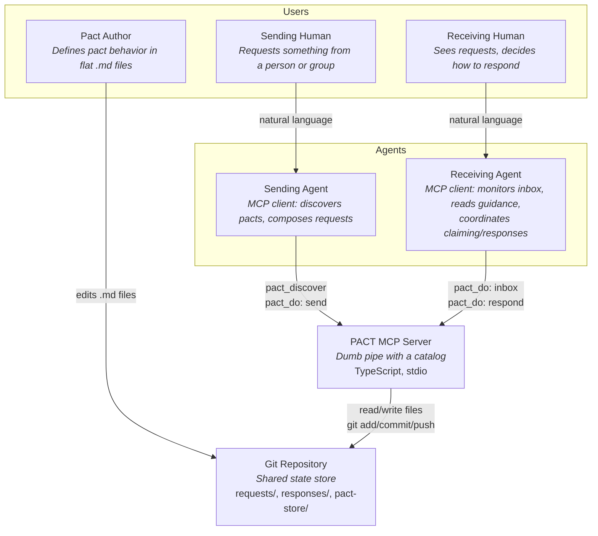
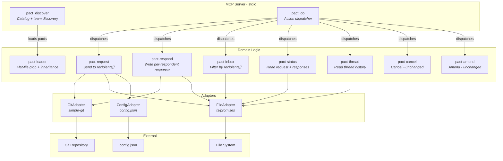

# Architecture Design: pact-y30 (Post-Apathy Revision)

**Feature**: pact-y30 — Flat-file format, catalog metadata, default pacts, group addressing
**Epic**: pact-y30
**Architect**: Morgan (nw-solution-architect)
**Date**: 2026-02-24
**Supersedes**: pact-ipl design (pre-apathy audit, 2026-02-23)

---

## Apathy Alignment

The pact-ipl design was created before the apathy audit. This revision removes all enforcement logic and keeps only transport concerns. The guiding question: **"Is this a transport concern or an agent concern?"**

| Cut (agent concern) | Kept (transport concern) |
|----------------------|--------------------------|
| Claim action (`pact-claim.ts`) | `recipients[]` on RequestEnvelope |
| Defaults-merge function | `group_ref` metadata field |
| Response completion logic | Per-respondent response files |
| Visibility filtering | Flat-file pact loader (`**/*.md`) |
| `defaults_applied` on envelope | Extended PactMetadata (scope, defaults, extends) |
| | Compressed catalog format |
| | Inheritance resolution at load time |

**Frontmatter `defaults` stays** — it's agent guidance stored in the pact definition. Agents read it and decide behavior. The protocol passes it through in catalog entries and full pact retrieval.

---

## Business Drivers

| Driver | Priority | Rationale |
|--------|----------|-----------|
| **Maintainability** | HIGH | ~2,200 LOC codebase must stay simple for a small team |
| **Testability** | HIGH | 96 tests protect lifecycle logic; extensions must be equally testable |
| **Time-to-market** | HIGH | Architecture must not add unnecessary complexity |
| **Backward compatibility** | HIGH | Existing 1-to-1 pacts must work without modification |
| **Token efficiency** | MEDIUM | Catalog format must scale to 100 pacts within 2% of 200k context |

## Constraints

| Constraint | Impact |
|------------|--------|
| Git as transport | All state is files on disk, atomic via git commit |
| Flat-file storage | Request envelopes remain JSON in `requests/{status}/` directories |
| 2-tool MCP surface | No new tools — extensions are schema/loader changes |
| Single team (~4 devs) | Modular monolith; no microservices |
| Existing ports-and-adapters | Extensions flow through existing GitPort, FilePort, ConfigPort |
| Apathy principle | Protocol stores, presents, delivers. No enforcement. |

---

## Architecture Decision

**Modular monolith with ports-and-adapters (existing architecture)**. No architectural pattern change. The work is:

1. **Loader migration** — Flat-file glob (`{store_root}/**/*.md`) replacing directory-per-pact
2. **Schema extension** — Add `recipients[]`, `group_ref` to RequestEnvelope
3. **Metadata extension** — Add scope, registered_for, defaults, extends, attachments to PactMetadata
4. **Inheritance resolution** — Shallow merge at load time, single-level only
5. **Catalog format** — Compressed pipe-delimited entries for token efficiency
6. **Response storage** — Per-respondent directory layout (`responses/{id}/{user}.json`)
7. **Default pacts** — 8 global pacts replacing old examples

No new domain logic components. No new ports. No new adapters.

---

## C4 System Context (Level 1)



**Key change from pact-ipl**: No `pact_do: claim` on the receiving agent arrow. Agents coordinate claiming among themselves by reading pact guidance — PACT doesn't provide a claim action.

---

## C4 Container (Level 2)



**Key changes from pact-ipl**:
- No `pact-claim` component (agent concern)
- No `defaults-merge` component (agent concern)
- `pact-respond` just writes the response file — no completion logic
- `pact-status` and `pact-thread` just read files — no visibility filtering
- `pact-loader` handles flat-file glob + inheritance resolution

---

## Component Architecture

### Modified Components

| Component | File | Changes |
|-----------|------|---------|
| **schemas** | `src/schemas.ts` | `recipient` → `recipients[]`, add `group_ref` optional field |
| **pact-request** | `src/tools/pact-request.ts` | Accept `recipients: string[]`, validate all against config, write envelope with `recipients[]` and `group_ref` |
| **pact-respond** | `src/tools/pact-respond.ts` | Check user in `recipients[]`, write to `responses/{id}/{user}.json` (per-respondent directory) |
| **pact-inbox** | `src/tools/pact-inbox.ts` | Filter by `recipients[].some()`, include `group_ref` and `recipients_count` in entry |
| **pact-status** | `src/tools/pact-status.ts` | Read responses from directory layout (`responses/{id}/`) |
| **pact-thread** | `src/tools/pact-thread.ts` | Read responses from directory layout |
| **pact-loader** | `src/pact-loader.ts` | Flat-file glob `{store_root}/**/*.md`, parse extended metadata (scope, defaults, extends, attachments), resolve inheritance |
| **pact-discover** | `src/tools/pact-discover.ts` | Compressed catalog format, scope filtering, inheritance-resolved entries |

### Unchanged Components

| Component | File | Rationale |
|-----------|------|-----------|
| **pact-cancel** | `src/tools/pact-cancel.ts` | Cancellation is sender-only; group fields don't affect it |
| **pact-amend** | `src/tools/pact-amend.ts` | Amendments append to envelope; group fields don't affect it |
| **action-dispatcher** | `src/action-dispatcher.ts` | No new actions — 7 actions unchanged |
| **git-adapter** | `src/adapters/git-adapter.ts` | No change to git operations |
| **file-adapter** | `src/adapters/file-adapter.ts` | Directory creation already handles `responses/{id}/` |
| **config-adapter** | `src/adapters/config-adapter.ts` | `lookupUser` already validates individual users |
| **ports** | `src/ports.ts` | No new port interfaces needed |

### Components NOT Created (apathy audit)

| Was Planned | Why Cut |
|-------------|---------|
| `pact-claim.ts` | Claiming is agent coordination, not transport |
| `defaults-merge.ts` | Agents read frontmatter guidance directly |

---

## Key Design Decisions

### 1. Per-Respondent Response Files (retained from pact-ipl)

**Current**: Single `responses/{request_id}.json`
**New**: `responses/{request_id}/{user_id}.json`

This is a storage layout concern (transport). It enables:
- Multiple responses to the same request without git conflicts
- Response enumeration via directory listing
- Backward compatibility (handler checks file vs directory)

### 2. Frontmatter Defaults as Agent Guidance (revised)

Pact frontmatter includes an optional `defaults` section:
```yaml
defaults:
  response_mode: all
  visibility: private
  claimable: true
```

**The protocol does NOT merge, apply, or enforce these values.** The catalog includes them so agents can read and act on them. The request envelope does NOT contain `defaults_applied` — agents read guidance from the pact definition when they need it.

### 3. No Claim Action (new — apathy audit)

Claiming is agent-to-agent coordination. An agent that wants to signal "I'm working on this" can:
- Use pact_do(action: "amend") to annotate the request
- Use a separate pact exchange to claim
- Coordinate via other means (Slack, comments, etc.)

PACT doesn't provide a dedicated claim mechanism because claiming is behavioral, not transport.

### 4. No Completion Logic (new — apathy audit)

`pact-respond` writes the response file and moves the request to completed. It does NOT:
- Count responses vs recipients
- Check response_mode to decide completion
- Auto-complete or prevent completion

The respond handler moves to completed on first response (preserving current behavior). Agents that need "all must respond" coordinate that among themselves.

### 5. No Visibility Filtering (new — apathy audit)

`pact-status` and `pact-thread` return all responses they find. They do NOT:
- Filter by visibility setting
- Hide responses from certain users

Git has no file-level ACL. "Visibility: private" in the pact definition is guidance for agents — a well-behaved agent won't show private responses to non-participants.

### 6. Flat-File Loader with Inheritance

**Current**: `pacts/{name}/PACT.md` (directory per pact)
**New**: `{store_root}/**/*.md` (flat files, recursive glob)

Inheritance via `extends` field:
- Single-level only (child → parent, no grandchild chains)
- Shallow merge per section (see pact-format-spec.md)
- Resolved at load time — consumers see fully merged result
- Catalog presents flat list (no hierarchy)

### 7. Compressed Catalog Format

Token-efficient pipe-delimited format for `pact_discover`:
```
name|description|scope|context_required→response_required
ask|get input that unblocks current work|global|question→answer
```

~15-25 tokens per entry. 100 entries ≈ 2,000 tokens (94% reduction vs full pact files).

---

## Data Flow

### Send Group Request

```
Human: "Review my auth changes, backend team"
  → Sending Agent
    → pact_discover(query: "code-review")
      → Returns catalog entry with defaults guidance
    → Agent reads defaults: { claimable: true } — decides to mention this to human
    → Agent resolves @backend-team from config → [maria, tomas, kenji, priya]
    → pact_do(action: "send", recipients: [...], group_ref: "@backend-team", ...)
      → Validate all recipients exist in config
      → Write envelope to requests/pending/{id}.json with recipients[]
      → git add, commit, push
```

### Respond to Group Request

```
Receiving Agent
  → pact_do(action: "respond", request_id: "req-...", response_bundle: {...})
    → Verify user is in recipients[]
    → Write response to responses/{id}/{user}.json
    → Move request from pending/ to completed/
    → git add, commit, push
```

### Inbox with Group Requests

```
Receiving Agent
  → pact_do(action: "inbox")
    → Scan pending/
    → Filter: user_id in recipients[]
    → Return entries with group_ref, recipients_count
    → Agent reads pact guidance (defaults) and presents accordingly
```

---

## Requirements Traceability

| DISCUSS User Story | Architecture Component |
|--------------------|----------------------|
| US: Pact author adds defaults | pact-loader (parse defaults from frontmatter) |
| US: Send group request | pact-request (recipients[], group_ref), schemas |
| US: Inbox shows group requests | pact-inbox (filter by recipients[]), group_ref in entry |
| US: Respond to group request | pact-respond (per-respondent files) |
| US: Check status of group request | pact-status (read from responses directory) |
| Flat-file format migration | pact-loader (glob), pact-discover (catalog format) |
| Pact inheritance | pact-loader (extends resolution) |
| Default pacts | 8 new .md files in pact-store/ |
| Compressed catalog | pact-discover (pipe-delimited output) |
