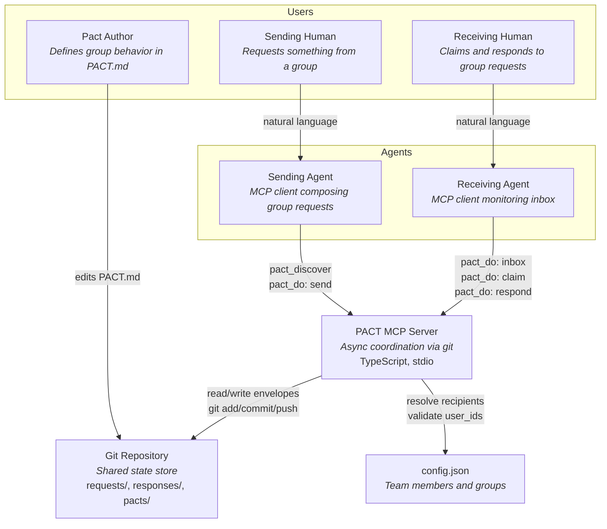
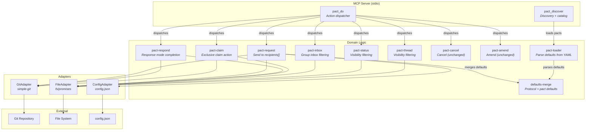
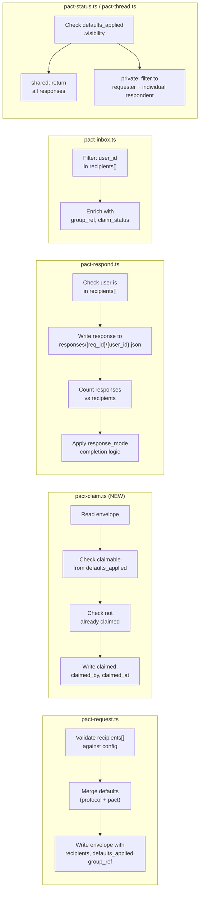

# Architecture Design: pact-fmt (Group Envelope Primitives)

**Feature**: pact-fmt
**Epic**: pact-y30
**Architect**: Morgan (nw-solution-architect)
**Date**: 2026-02-23

---

## Business Drivers

| Driver | Priority | Rationale |
|--------|----------|-----------|
| **Maintainability** | HIGH | ~2,200 LOC codebase must stay simple for small team |
| **Testability** | HIGH | 96 tests protect lifecycle logic; group extensions must be equally testable |
| **Time-to-market** | HIGH | 5 user stories, 8-13 day estimate; architecture must not add unnecessary complexity |
| **Backward compatibility** | HIGH | Existing 1-to-1 pacts must work without modification |
| **Token efficiency** | MEDIUM | Group fields add ~31 tokens per pact; must stay within 2% of 200k context |

## Constraints

| Constraint | Impact |
|------------|--------|
| Git as transport | Claiming concurrency resolved by git atomic file write + timestamp ordering |
| Flat-file storage | Request envelopes remain JSON in `requests/{status}/` directories |
| 2-tool MCP surface | `claim` is a new action within `pact_do`, not a new tool |
| Single team (~4 devs) | Architecture must remain modular monolith; no microservices |
| Existing ports-and-adapters | Extensions must flow through existing GitPort, FilePort, ConfigPort |

## Architecture Decision

**Modular monolith with ports-and-adapters (existing architecture)**. No architectural change needed — the current design handles group extensions cleanly through:

1. **Schema extension** — Add group fields to existing Zod schemas
2. **New action handler** — `pact-claim.ts` registered in action dispatcher
3. **Modified handlers** — Inbox filtering, response completion, visibility filtering
4. **Defaults merge** — Pure function composing protocol + pact-level defaults

This is the simplest solution that satisfies all requirements. The ports-and-adapters pattern means group logic lives in domain handlers, not in adapters.

---

## C4 System Context (Level 1)



---

## C4 Container (Level 2)



---

## C4 Component (Level 3): Group Request Lifecycle

This diagram shows the internal flow for group-specific operations.



---

## Component Architecture

### New Components

| Component | File | Responsibility |
|-----------|------|---------------|
| **pact-claim** | `src/tools/pact-claim.ts` | Exclusive claim action for claimable group requests |
| **defaults-merge** | `src/defaults-merge.ts` | Pure function: merge protocol defaults + pact defaults |

### Modified Components

| Component | File | Changes |
|-----------|------|---------|
| **schemas** | `src/schemas.ts` | Add `recipients`, `group_ref`, `defaults_applied`, claim fields to RequestEnvelope. Add `defaults` to PactMetadata. |
| **action-dispatcher** | `src/action-dispatcher.ts` | Register "claim" action |
| **pact-request** | `src/tools/pact-request.ts` | Accept `recipients[]`, resolve group, merge defaults, write `defaults_applied` |
| **pact-respond** | `src/tools/pact-respond.ts` | Check user in `recipients[]`, per-respondent response files, response_mode completion logic |
| **pact-inbox** | `src/tools/pact-inbox.ts` | Filter by `recipients[].some()`, enrich with group_ref and claim status |
| **pact-status** | `src/tools/pact-status.ts` | Visibility filtering on response retrieval |
| **pact-thread** | `src/tools/pact-thread.ts` | Visibility filtering on response retrieval |
| **pact-loader** | `src/pact-loader.ts` | Parse `defaults` section from YAML frontmatter |
| **pact-discover** | `src/tools/pact-discover.ts` | Include merged defaults in discovery results |

### Unchanged Components

| Component | File | Rationale |
|-----------|------|-----------|
| **pact-cancel** | `src/tools/pact-cancel.ts` | Cancellation is sender-only; group fields don't affect it |
| **pact-amend** | `src/tools/pact-amend.ts` | Amendments append to envelope; group fields don't affect it |
| **git-adapter** | `src/adapters/git-adapter.ts` | No change — existing retry/rebase handles claim concurrency |
| **file-adapter** | `src/adapters/file-adapter.ts` | No change — directory creation handles responses/{req_id}/ |
| **config-adapter** | `src/adapters/config-adapter.ts` | No change — `lookupUser` already validates individual users |
| **ports** | `src/ports.ts` | No new port interfaces needed |

---

## Key Design Decisions

### 1. Per-Respondent Response Files

**Current**: Single `responses/{request_id}.json` (one response per request)
**New**: `responses/{request_id}/{user_id}.json` (one response per respondent)

This enables:
- **Response counting** for `response_mode: all` (count files in directory)
- **Visibility filtering** for `visibility: private` (filter by user_id)
- **No git conflicts** — different respondents write to different file paths

### 2. Defaults Merge as Pure Function

Protocol defaults are hardcoded constants:
```typescript
const PROTOCOL_DEFAULTS = {
  response_mode: "any",
  visibility: "shared",
  claimable: false,
} as const;
```

The merge function: `mergeDefaults(protocolDefaults, pactDefaults) → resolvedDefaults`
- Pact-level values override protocol values
- Missing pact fields inherit protocol defaults
- Result written as `defaults_applied` on request envelope (immutable after send)

### 3. Claim as Envelope Mutation

Claiming writes directly to the request envelope JSON:
```json
{
  "claimed": true,
  "claimed_by": { "user_id": "kenji", "display_name": "Kenji" },
  "claimed_at": "2026-02-23T09:31:15Z"
}
```

Git's atomic file write + commit provides exclusivity. The second claimer:
1. Pulls latest (sees claim already written)
2. Returns `already_claimed` error with claimer info

### 4. Response Mode Completion Logic

Completion check runs after every response:
- `any`: `responseCount >= 1` → move to completed
- `all`: `responseCount === recipients.length` → move to completed
- `none_required`: never auto-completes from responses

For `any` mode: the first response triggers `git mv` to completed. Subsequent responses still stored in `responses/{request_id}/` but the request is already completed.

### 5. Visibility Filtering at Read Time

Visibility is enforced at read time (pact-status, pact-thread), not write time:
- **shared**: Return all response files from `responses/{request_id}/`
- **private**: Filter to responses where `responder.user_id === currentUser` OR `sender.user_id === currentUser` (requester sees all)

This keeps the write path simple and the filtering logic centralized.

---

## Data Flow

### Send Group Request

```
Human: "Review my auth changes, backend team"
  → Sending Agent
    → pact_discover(query: "code-review")
      → Returns pact metadata with defaults: { claimable: true }
    → Agent resolves @backend-team from config → [maria, tomas, kenji, priya]
    → pact_do(action: "send", recipients: [...], group_ref: "@backend-team", ...)
      → mergeDefaults(PROTOCOL, pactDefaults) → defaults_applied
      → Write envelope to requests/pending/{id}.json
      → git add, commit, push
```

### Claim and Respond

```
Receiving Agent
  → pact_do(action: "inbox")
    → Scan pending/
    → Filter: kenji in recipients[]
    → Enrich with group_ref, claim_status
    → Return inbox entry with "Unclaimed, claimable"