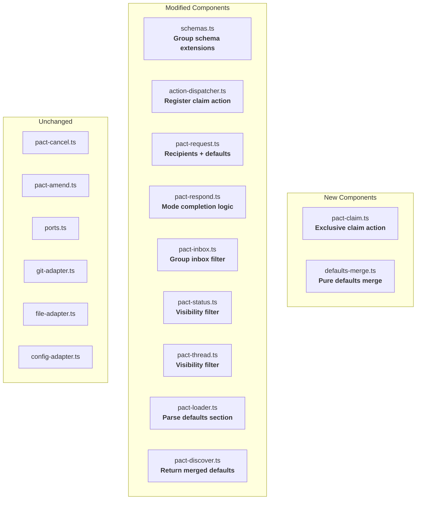

# Component Boundaries: pact-fmt (Group Envelope Primitives)

**Feature**: pact-fmt
**Date**: 2026-02-23
**Architect**: Morgan (nw-solution-architect)

---

## Boundary Diagram



---

## New Component: defaults-merge.ts

**Responsibility**: Compose resolved defaults from protocol constants and pact-level overrides.

**Boundary**: Pure function. No I/O, no ports, no side effects.

**Contract**:
```
Input:  protocolDefaults: GroupDefaults, pactDefaults: Partial<GroupDefaults> | undefined
Output: GroupDefaults (complete, no null values)
```

**Rules**:
- Pact-level values override protocol values
- Missing pact fields inherit protocol defaults
- Output is always a complete `GroupDefaults` object
- Called by pact-request (at send time) and pact-discover (for catalog)

---

## New Component: pact-claim.ts

**Responsibility**: Mark a claimable request as claimed by the current user.

**Boundary**: Action handler. Receives ports via DispatchContext. Single responsibility.

**Contract**:
```
Input:  { request_id: string }, ctx: DispatchContext
Output: { status: "claimed", request_id, claimed_by } | Error
```

**Rules**:
- Read request envelope from `requests/pending/`
- Validate `defaults_applied.claimable === true` → else return `not_claimable`
- Validate `claimed !== true` → else return `already_claimed` with claimer info
- Write `claimed: true`, `claimed_by: UserRef`, `claimed_at: ISO8601` to envelope
- Validate current user is in `recipients[]` → else return `not_a_recipient`
- Git add + commit + push (atomic)
- Request stays in `pending/` (claim does not change status)

**Concurrency**: If two agents claim simultaneously:
1. Both read the envelope (no claim yet)
2. First to push succeeds
3. Second's push fails → git pull --rebase → reads updated envelope with claim → returns `already_claimed`

---

## Modified Component: schemas.ts

**Changes**:

1. **RequestEnvelope**: Replace `recipient: UserRef` with `recipients: UserRef[]`. Add `group_ref?: string`, `defaults_applied: GroupDefaults`, claim fields (`claimed`, `claimed_by`, `claimed_at`).

2. **PactMetadata**: Add `defaults?: Partial<GroupDefaults>`.

3. **New type**: `GroupDefaults = { response_mode, visibility, claimable }`.

4. **ResponseEnvelope**: No schema change. Per-respondent storage is a file layout change, not a schema change.

**Migration**: `recipient` → `recipients` is a breaking change. Tests must migrate. Single-recipient requests use `recipients: [user]`.

---

## Modified Component: pact-request.ts

**Changes**:
- Accept `recipients: string[]` (array of user_ids) instead of `recipient: string`
- Accept optional `group_ref: string`
- Validate all user_ids in recipients against config
- Call `mergeDefaults()` to produce `defaults_applied`
- Write envelope with `recipients`, `group_ref`, `defaults_applied`

**Boundary preserved**: Still uses GitPort, FilePort, ConfigPort via context. No new ports.

---

## Modified Component: pact-respond.ts

**Changes**:
- Validate current user is in `recipients[]` (not just `recipient.user_id === ctx.userId`)
- Write response to `responses/{request_id}/{user_id}.json` (per-respondent)
- After writing response, apply completion logic based on `defaults_applied.response_mode`:
  - `any`: Move request to completed
  - `all`: Count response files in `responses/{request_id}/`. If count === `recipients.length`, move to completed
  - `none_required`: Do not move to completed

**Boundary preserved**: Completion logic is a domain decision in this handler. No new ports needed.

---

## Modified Component: pact-inbox.ts

**Changes**:
- Filter: `recipients.some(r => r.user_id === ctx.userId)` instead of `recipient.user_id === ctx.userId`
- Enrich each inbox entry with:
  - `group_ref` (from envelope)
  - `claimed: boolean`, `claimed_by: UserRef`, `claimed_at: string` (from envelope)
  - `defaults_applied.response_mode` and `defaults_applied.claimable` (for agent decision-making)

**Boundary preserved**: Read-only query. No new ports.

---

## Modified Components: pact-status.ts, pact-thread.ts

**Changes**: Add visibility filtering on response retrieval.

When loading responses for a request:
1. Read `defaults_applied.visibility` from request envelope
2. If `shared`: return all response files from `responses/{request_id}/`
3. If `private`: filter responses to:
   - Current user is the respondent (`responder.user_id === ctx.userId`)
   - OR current user is the requester (`sender.user_id === ctx.userId`)

**Boundary preserved**: Read-only filtering. No new ports.

---

## Modified Component: pact-loader.ts

**Changes**: Parse optional `defaults` section from YAML frontmatter.

```yaml
defaults:
  response_mode: all
  visibility: private
  claimable: false
```

If `defaults` section is missing, return `undefined` (pact uses protocol defaults).

**Boundary preserved**: Still uses FilePort for file reading. Metadata interface extends with optional `defaults` field.

---

## Modified Component: pact-discover.ts

**Changes**: Include merged defaults in discovery results.

For each discovered pact:
1. Load pact metadata (includes `defaults` if present)
2. Call `mergeDefaults(PROTOCOL_DEFAULTS, pact.defaults)`
3. Include resolved defaults in the pact entry returned to the agent

**Boundary preserved**: Read-only discovery. No new ports.

---

## Dependency Direction

All dependencies point inward (toward domain logic), consistent with ports-and-adapters:

```
Adapters → Domain ← MCP Server
    ↑                    ↑
  (impl)              (calls)
    |                    |
  Ports    ←    Action Handlers
```

- `defaults-merge.ts` has zero dependencies (pure function)
- `pact-claim.ts` depends on ports (via context) and schemas
- Modified handlers depend on ports (via context), schemas, and defaults-merge
- No handler depends on another handler
- No adapter changes required

---

## File Storage Layout Change

### Current (single response per request)
```
responses/
  req-20260223-100000-cory-a1b2.json
```

### New (per-respondent responses)
```
responses/
  req-20260223-100000-cory-a1b2/
    kenji.json
    maria.json
    tomas.json
    priya.json
```

**Migration**: Existing single-response files remain valid. The respond handler checks if `responses/{request_id}` is a file (old format) or directory (new format) and handles both. New responses always use the directory format.

---

## Integration Points

| Integration | Between | Contract |
|------------|---------|----------|
| IC1: Defaults merge | pact_discover ↔ pact_do:send | Protocol defaults + pact defaults produce valid merged config |
| IC2: Group resolution | config.json ↔ pact_do:send | All user_ids in recipients[] exist in config |
| IC3: Inbox filtering | pact_do:send ↔ pact_do:inbox | Group requests appear for all recipients |
| IC4: Claim exclusivity | pact_do:claim ↔ pact_do:claim | Second claim fails with already_claimed |
| IC5: Claim visibility | pact_do:claim ↔ pact_do:inbox | Claimed status visible to all recipients |
| IC6: Response routing | pact_do:respond ↔ visibility | Private responses hidden from other respondents |
| IC7: Completion by mode | pact_do:respond ↔ response_mode | Request completes according to mode |

---

## Error Handling Contracts

Error paths from the UX journey (ERR1-ERR4), mapped to handler responsibilities.

### ERR1: Claim Race Condition

**Handler**: `pact-claim.ts`
**Trigger**: Two agents attempt to claim the same request simultaneously.
**Detection**: `git push` fails → `git pull --rebase` → re-read envelope → `claimed === true`.
**Error response**: `{ error: "already_claimed", request_id, claimed_by: UserRef, claimed_at: ISO8601 }`
**Agent behavior**: Log claim info, notify human "This was just claimed by @name", present other unclaimed items.

### ERR2: No One Claims (Stale Claim)

**Handler**: None (apathetic design — PACT does not track claim staleness)
**Trigger**: Claimable request sits unclaimed indefinitely.
**Detection**: Sender calls `pact_do(action: "check_status")` → sees status "pending", `claimed: false`.
**Response**: Return normal status. No error. Human decides to re-send, ping the group, or handle it themselves.

### ERR3: All-Respond Partial Responses

**Handler**: `pact-respond.ts`
**Trigger**: `response_mode: all` but some recipients haven't responded.
**Detection**: After each response, count response files vs `recipients.length`. If count < length, request stays pending.
**Response**: Return `{ status: "response_recorded", responses_received: N, responses_needed: M }`. No error — the system is apathetic about nudging. Sender can check_status to see progress.

### ERR4: Private Response Leak Attempt

**Handler**: `pact-status.ts`, `pact-thread.ts`
**Trigger**: Agent requests responses for a `visibility: private` request.
**Detection**: Filter responses at read time: only include responses where `responder.user_id === ctx.userId` OR `sender.user_id === ctx.userId`.
**Response**: Return filtered response list. No error — the agent simply doesn't see responses they're not authorized to view. The absence of other responses IS the privacy mechanism.

### General Error Propagation

All action handlers follow the same pattern:
1. Validate inputs (return descriptive error with error type)
2. Execute operation (return result)
3. On git push failure: retry once via pull-rebase-push
4. On unrecoverable failure: return error with context for agent to display to human
