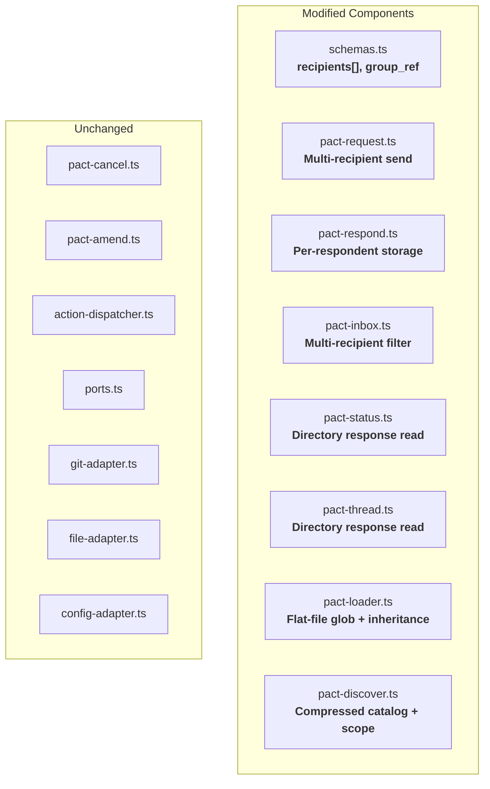

# Component Boundaries: pact-y30 (Post-Apathy Revision)

**Feature**: pact-y30
**Date**: 2026-02-24
**Architect**: Morgan (nw-solution-architect)
**Supersedes**: pact-ipl component-boundaries (pre-apathy audit)

---

## Boundary Diagram



---

## Modified Component: schemas.ts

**Changes**:

1. **RequestEnvelope**: Replace `recipient: UserRef` with `recipients: UserRef[]`. Add optional `group_ref: string`.
2. **PactMetadata**: Add `scope`, `registered_for`, `defaults`, `extends`, `attachments`, `multi_round`.

**Not added** (apathy audit):
- No `defaults_applied` on RequestEnvelope
- No `claimed`, `claimed_by`, `claimed_at` fields
- No `GroupDefaults` schema type

**Migration**: `recipient` → `recipients` is a breaking change. Single-recipient requests use `recipients: [user]`.

---

## Modified Component: pact-request.ts

**Changes**:
- Accept `recipients: string[]` (array of user_ids) instead of `recipient: string`
- Accept optional `group_ref: string`
- Validate all user_ids in recipients against config
- Write envelope with `recipients[]` and `group_ref`

**Not added** (apathy audit):
- No defaults merge call
- No `defaults_applied` written to envelope

**Boundary preserved**: Still uses GitPort, FilePort, ConfigPort via context. No new ports.

---

## Modified Component: pact-respond.ts

**Changes**:
- Validate current user is in `recipients[]` (not just `recipient.user_id === ctx.userId`)
- Write response to `responses/{request_id}/{user_id}.json` (per-respondent directory)
- Move request from pending/ to completed/ (same as today — first response completes)

**Not added** (apathy audit):
- No response counting
- No response_mode completion logic (`any`/`all`/`none_required`)
- No conditional completion based on `defaults_applied`

**Boundary preserved**: Single responsibility — write response, move to completed.

---

## Modified Component: pact-inbox.ts

**Changes**:
- Filter: `recipients.some(r => r.user_id === ctx.userId)` instead of `recipient.user_id === ctx.userId`
- Include `group_ref` and `recipients_count` in inbox entries

**Not added** (apathy audit):
- No claim status enrichment (no `claimed`, `claimed_by`, `claimed_at`)
- No `response_mode` or `claimable` in inbox entries

**Boundary preserved**: Read-only query. No new ports.

---

## Modified Components: pact-status.ts, pact-thread.ts

**Changes**: Read responses from directory layout.

When loading responses for a request:
1. Check if `responses/{request_id}` is a directory → read all `.json` files within
2. Check if `responses/{request_id}.json` is a file → old format (single response)

**Not added** (apathy audit):
- No visibility filtering (no checking `defaults_applied.visibility`)
- No response filtering by user

**Boundary preserved**: Read-only. No new ports.

---

## Modified Component: pact-loader.ts

**Changes**:
- Path resolution: `{store_root}/**/*.md` glob replacing `pacts/{name}/PACT.md`
- Drop `readSchemaIfValid()` fallback (schema.json no longer needed)
- Drop Markdown table fallback — all pacts must use YAML frontmatter
- Parse extended metadata: `scope`, `registered_for`, `extends`, `defaults`, `attachments`, `multi_round`, `hooks`
- Resolve inheritance: if `extends` is present, load parent, shallow-merge per resolution rules, return resolved result
- Return resolved (flat) PactMetadata — consumer never sees inheritance chain

**Boundary preserved**: Still uses FilePort for file reading. Metadata interface extends with new optional fields.

---

## Modified Component: pact-discover.ts

**Changes**:
- Compressed catalog format: pipe-delimited entries (~15-25 tokens each)
- Include `scope` and `defaults` summary in catalog entries
- Show inheritance-resolved entries (flat list, no hierarchy)
- Scope-based filtering on catalog retrieval

**Boundary preserved**: Read-only discovery. No new ports.

---

## Dependency Direction

All dependencies point inward (toward domain logic), consistent with ports-and-adapters:

```
Adapters → Domain ← MCP Server
    ↑                    ↑
  (impl)              (calls)
    |                    |
  Ports    ←    Action Handlers
```

- Modified handlers depend on ports (via context) and schemas
- No handler depends on another handler
- No adapter changes required
- No new port interfaces needed

---

## File Storage Layout Change

### Current (single response per request)
```
responses/
  req-20260223-100000-cory-a1b2.json
```

### New (per-respondent responses)
```
responses/
  req-20260223-100000-cory-a1b2/
    kenji.json
    maria.json
```

**Migration**: The respond handler checks if `responses/{request_id}` is a file (old format) or directory (new format) and handles both. New responses always use the directory format.

---

## Pact Store Layout Change

### Current (directory per pact)
```
pacts/
  ask/
    PACT.md
    schema.json
  code-review/
    PACT.md
    schema.json
```

### New (flat files with optional subdirectories)
```
pact-store/
  ask.md
  propose.md
  share.md
  request.md
  handoff.md
  check-in.md
  decide.md
  review.md
  backend/
    request:backend.md
    review:backend.md
```

---

## Integration Points

| Integration | Between | Contract |
|------------|---------|----------|
| IC1: Group send | pact_do:send ↔ config.json | All user_ids in recipients[] exist in config |
| IC2: Inbox filtering | pact_do:send ↔ pact_do:inbox | Group requests appear for all recipients |
| IC3: Response storage | pact_do:respond ↔ pact_do:status | Per-respondent files readable by status/thread |
| IC4: Inheritance | pact-loader extends ↔ pact-loader parent | Resolved metadata is complete and consistent |
| IC5: Catalog | pact-loader ↔ pact_discover | Compressed entries match full pact metadata |
| IC6: Backward compat | old format ↔ new format | Single-response files still readable |

**Removed** (apathy audit): IC for claim exclusivity, claim visibility, response routing by visibility, completion by mode.
