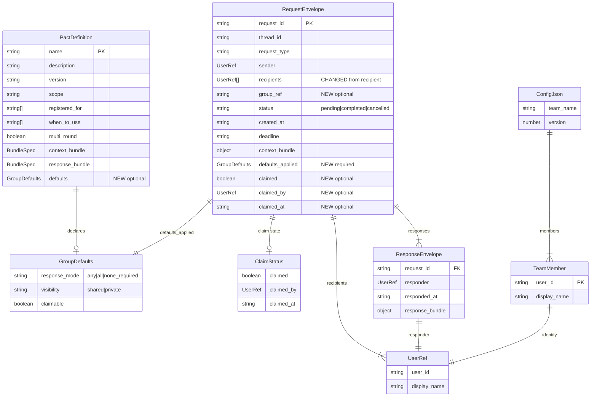

# Data Models: pact-fmt (Group Envelope Primitives)

**Feature**: pact-fmt
**Date**: 2026-02-23
**Architect**: Morgan (nw-solution-architect)

---

## Entity Relationship Diagram



---

## Schema Changes

### New Type: GroupDefaults

```typescript
const GroupDefaultsSchema = z.object({
  response_mode: z.enum(["any", "all", "none_required"]),
  visibility: z.enum(["shared", "private"]),
  claimable: z.boolean(),
});

type GroupDefaults = z.infer<typeof GroupDefaultsSchema>;
```

**Protocol defaults** (hardcoded):
```typescript
const PROTOCOL_DEFAULTS: GroupDefaults = {
  response_mode: "any",
  visibility: "shared",
  claimable: false,
};
```

### Modified: PactMetadata

```typescript
interface PactMetadata {
  name: string;
  version?: string;
  description: string;
  when_to_use: string[];
  context_bundle: BundleSpec;
  response_bundle: BundleSpec;
  has_hooks: boolean;
  defaults?: Partial<GroupDefaults>;  // NEW: optional, partial
}
```

Pact authors only specify fields that differ from protocol defaults:
```yaml
defaults:
  claimable: true
  # response_mode and visibility inherit "any" and "shared" from protocol
```

### Modified: RequestEnvelope

```typescript
const RequestEnvelopeSchema = z.object({
  request_id: z.string(),
  thread_id: z.string().optional(),
  request_type: z.string(),
  sender: UserRefSchema,
  recipients: z.array(UserRefSchema),        // CHANGED: was recipient: UserRef
  group_ref: z.string().optional(),          // NEW
  status: z.string(),
  created_at: z.string(),
  deadline: z.string().nullable().optional(),
  context_bundle: z.record(z.string(), z.unknown()),
  expected_response: z.record(z.string(), z.unknown()).optional(),
  attachments: z.array(AttachmentSchema).optional(),
  amendments: z.array(AmendmentEntrySchema).optional(),
  cancel_reason: z.string().optional(),
  defaults_applied: GroupDefaultsSchema,      // NEW: required, complete
  claimed: z.boolean().optional(),            // NEW
  claimed_by: UserRefSchema.optional(),       // NEW
  claimed_at: z.string().optional(),          // NEW
});
```

### Unchanged: ResponseEnvelope

```typescript
// No schema change
const ResponseEnvelopeSchema = z.object({
  request_id: z.string(),
  responder: UserRefSchema,
  responded_at: z.string(),
  response_bundle: z.record(z.string(), z.unknown()),
});
```

The per-respondent storage is a **file layout change**, not a schema change. Each response file has the same `ResponseEnvelope` structure.

---

## File Layout Changes

### Request Envelope (on disk)

**Before**:
```json
{
  "request_id": "req-20260223-100000-cory-a1b2",
  "request_type": "code-review",
  "sender": { "user_id": "cory", "display_name": "Cory" },
  "recipient": { "user_id": "kenji", "display_name": "Kenji" },
  "status": "pending",
  "created_at": "2026-02-23T10:00:00Z",
  "context_bundle": { "repository": "pact", "branch": "feature/auth" }
}
```

**After**:
```json
{
  "request_id": "req-20260223-100000-cory-a1b2",
  "request_type": "code-review",
  "sender": { "user_id": "cory", "display_name": "Cory" },
  "recipients": [
    { "user_id": "maria", "display_name": "Maria" },
    { "user_id": "tomas", "display_name": "Tomas" },
    { "user_id": "kenji", "display_name": "Kenji" },
    { "user_id": "priya", "display_name": "Priya" }
  ],
  "group_ref": "@backend-team",
  "status": "pending",
  "created_at": "2026-02-23T10:00:00Z",
  "context_bundle": { "repository": "pact", "branch": "feature/auth" },
  "defaults_applied": {
    "response_mode": "any",
    "visibility": "shared",
    "claimable": true
  },
  "claimed": true,
  "claimed_by": { "user_id": "kenji", "display_name": "Kenji" },
  "claimed_at": "2026-02-23T10:05:30Z"
}
```

### Response Storage Layout

**Before**: `responses/{request_id}.json` (single file)

**After**: `responses/{request_id}/{user_id}.json` (per-respondent directory)

```
responses/
  req-20260223-100000-cory-a1b2/
    kenji.json     ← Kenji's response
    maria.json     ← Maria's response (if response_mode: all)
```

Each file is a standard `ResponseEnvelope`:
```json
{
  "request_id": "req-20260223-100000-cory-a1b2",
  "responder": { "user_id": "kenji", "display_name": "Kenji" },
  "responded_at": "2026-02-23T10:15:00Z",
  "response_bundle": { "status": "approved", "summary": "LGTM" }
}
```

### Backward Compatibility

The respond handler supports both layouts:
1. Check if `responses/{request_id}` is a directory → new format (per-respondent)
2. Check if `responses/{request_id}.json` is a file → old format (single response)
3. New responses always use the directory format

---

## Pact Definition Format Extension

### Before (existing PACT.md frontmatter)

```yaml
---
name: code-review
description: Structured PR review with blocking/advisory feedback
version: "1.0"
scope: org
when_to_use:
  - Finished a branch and want review before merge
context_bundle:
  required: [repository, branch]
  fields:
    repository: { type: string, description: "Repository name" }
    branch: { type: string, description: "Branch to review" }
response_bundle:
  required: [status, summary]
  fields:
    status: { type: string, enum: [approved, changes_requested], description: "Review verdict" }
    summary: { type: string, description: "Review summary" }
---
```

### After (with group defaults)

```yaml
---
name: code-review
description: Structured PR review with blocking/advisory feedback
version: "1.1"
scope: org
when_to_use:
  - Finished a branch and want review before merge
defaults:
  claimable: true
context_bundle:
  required: [repository, branch]
  fields:
    repository: { type: string, description: "Repository name" }
    branch: { type: string, description: "Branch to review" }
response_bundle:
  required: [status, summary]
  fields:
    status: { type: string, enum: [approved, changes_requested], description: "Review verdict" }
    summary: { type: string, description: "Review summary" }
---
```

Note: Only `claimable: true` is specified because `response_mode: any` and `visibility: shared` match protocol defaults — convention over configuration.

---

## Compressed Catalog Entry Extension

### Before
```
name|description|scope|context_required->response_required
code-review|structured PR review with blocking/advisory feedback|org|repository,branch->status,summary
```

### After
```
name|description|scope|context_required->response_required|defaults
code-review|structured PR review with blocking/advisory feedback|org|repository,branch->status,summary|any/shared/claimable
```

The `defaults` suffix uses a compact notation:
- `any/shared` → protocol defaults (omit if all defaults match protocol)
- `any/shared/claimable` → response_mode: any, visibility: shared, claimable: true
- `all/private` → response_mode: all, visibility: private, claimable: false

---

## Inbox Entry Extension

### Before
```typescript
interface InboxEntry {
  request_id: string;
  short_id: string;
  thread_id?: string;
  request_type: string;
  sender: string;
  created_at: string;
  summary: string;
  pact_path: string;
  attachment_count: number;
  amendment_count: number;
}
```

### After
```typescript
interface InboxEntry {
  request_id: string;
  short_id: string;
  thread_id?: string;
  request_type: string;
  sender: string;
  created_at: string;
  summary: string;
  pact_path: string;
  attachment_count: number;
  amendment_count: number;
  // Group fields (NEW)
  group_ref?: string;
  recipients_count: number;
  response_mode: string;
  claimable: boolean;
  claimed?: boolean;
  claimed_by?: string;
  claimed_at?: string;
}
```
