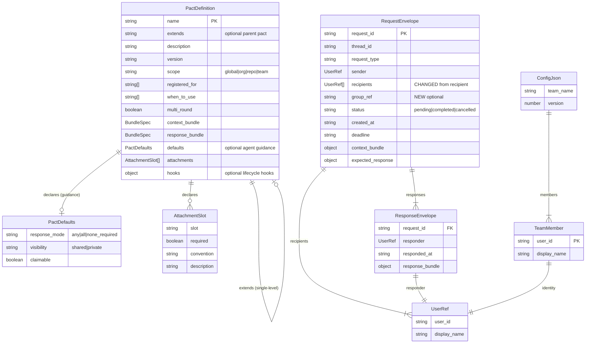

# Data Models: pact-y30 (Post-Apathy Revision)

**Feature**: pact-y30
**Date**: 2026-02-24
**Architect**: Morgan (nw-solution-architect)
**Supersedes**: pact-ipl data-models (pre-apathy audit)

---

## Entity Relationship Diagram



---

## Schema Changes

### Modified: RequestEnvelope

```typescript
const RequestEnvelopeSchema = z.object({
  request_id: z.string(),
  thread_id: z.string().optional(),
  request_type: z.string(),
  sender: UserRefSchema,
  recipients: z.array(UserRefSchema),        // CHANGED: was recipient: UserRef
  group_ref: z.string().optional(),          // NEW: optional group label
  status: z.string(),
  created_at: z.string(),
  deadline: z.string().nullable().optional(),
  context_bundle: z.record(z.string(), z.unknown()),
  expected_response: z.record(z.string(), z.unknown()).optional(),
  attachments: z.array(AttachmentSchema).optional(),
  amendments: z.array(AmendmentEntrySchema).optional(),
  cancel_reason: z.string().optional(),
});
```

**Not added** (apathy audit):
- No `defaults_applied: GroupDefaults` — agents read pact guidance directly
- No `claimed`, `claimed_by`, `claimed_at` — claiming is agent coordination

### Modified: PactMetadata

```typescript
interface PactMetadata {
  name: string;
  description: string;
  version?: string;
  scope?: string;                      // NEW: global|org|repo|team
  registered_for?: string[];           // NEW: scope qualifiers
  when_to_use: string[];
  multi_round?: boolean;               // NEW: thread continuation
  context_bundle: BundleSpec;
  response_bundle: BundleSpec;
  defaults?: Partial<PactDefaults>;    // NEW: agent guidance (optional, partial)
  extends?: string;                    // NEW: parent pact name
  attachments?: AttachmentSlot[];      // NEW: declared attachment slots
  has_hooks: boolean;
}
```

### New Type: PactDefaults (agent guidance only)

```typescript
interface PactDefaults {
  response_mode: "any" | "all" | "none_required";
  visibility: "shared" | "private";
  claimable: boolean;
}
```

This type is used in PactMetadata and in the compressed catalog. It is **not** stored on the RequestEnvelope. Agents read it from the pact definition when they need to decide behavior.

### New Type: AttachmentSlot

```typescript
interface AttachmentSlot {
  slot: string;
  required: boolean;
  convention: string;
  description: string;
}
```

### Unchanged: ResponseEnvelope

```typescript
const ResponseEnvelopeSchema = z.object({
  request_id: z.string(),
  responder: UserRefSchema,
  responded_at: z.string(),
  response_bundle: z.record(z.string(), z.unknown()),
});
```

The per-respondent storage is a **file layout change**, not a schema change.

---

## File Layout Changes

### Request Envelope (on disk)

**Before**:
```json
{
  "request_id": "req-20260223-100000-cory-a1b2",
  "request_type": "code-review",
  "sender": { "user_id": "cory", "display_name": "Cory" },
  "recipient": { "user_id": "kenji", "display_name": "Kenji" },
  "status": "pending",
  "created_at": "2026-02-23T10:00:00Z",
  "context_bundle": { "repository": "pact", "branch": "feature/auth" }
}
```

**After**:
```json
{
  "request_id": "req-20260223-100000-cory-a1b2",
  "request_type": "code-review",
  "sender": { "user_id": "cory", "display_name": "Cory" },
  "recipients": [
    { "user_id": "maria", "display_name": "Maria" },
    { "user_id": "tomas", "display_name": "Tomas" },
    { "user_id": "kenji", "display_name": "Kenji" },
    { "user_id": "priya", "display_name": "Priya" }
  ],
  "group_ref": "@backend-team",
  "status": "pending",
  "created_at": "2026-02-23T10:00:00Z",
  "context_bundle": { "repository": "pact", "branch": "feature/auth" }
}
```

**Note**: No `defaults_applied`, no `claimed` fields. The envelope is simpler — just addressing and payload.

### Response Storage Layout

**Before**: `responses/{request_id}.json` (single file)

**After**: `responses/{request_id}/{user_id}.json` (per-respondent directory)

```
responses/
  req-20260223-100000-cory-a1b2/
    kenji.json
    maria.json
```

Each file is a standard `ResponseEnvelope`:
```json
{
  "request_id": "req-20260223-100000-cory-a1b2",
  "responder": { "user_id": "kenji", "display_name": "Kenji" },
  "responded_at": "2026-02-23T10:15:00Z",
  "response_bundle": { "status": "approved", "summary": "LGTM" }
}
```

### Backward Compatibility

The respond handler supports both layouts:
1. Check if `responses/{request_id}` is a directory → new format
2. Check if `responses/{request_id}.json` is a file → old format
3. New responses always use the directory format

---

## Compressed Catalog Entry

```
name|description|scope|context_required→response_required
code-review|structured PR review with blocking/advisory feedback|org|repository,branch→status,summary
```

Scope and defaults are included as metadata — agents parse them to understand pact behavior without loading the full file.

---

## Inbox Entry Extension

```typescript
interface InboxEntry {
  request_id: string;
  short_id: string;
  thread_id?: string;
  request_type: string;
  sender: string;
  created_at: string;
  summary: string;
  pact_path: string;
  attachment_count: number;
  amendment_count: number;
  // Group fields (NEW)
  group_ref?: string;
  recipients_count: number;
}
```

**Not added** (apathy audit): No `response_mode`, `claimable`, `claimed`, `claimed_by`, `claimed_at` in inbox entries. Agents that need this information read the pact definition.

---

## Migration Strategies

### Schema: recipient → recipients[]

All handlers that read request envelopes must support both formats during transition:

1. **Read coercion**: When parsing a request envelope, check for `recipient` (old) or `recipients` (new). If `recipient` exists and `recipients` does not, coerce: `recipients = [recipient]`.
2. **Write**: All new requests use `recipients[]`. No old-format writes.
3. **Tests**: Existing test fixtures that use `recipient` must be updated to `recipients`. Add backward compat test: "Old-format request (recipient field) is readable by new code."

This is a breaking schema change but only affects on-disk format. The Zod schema validates `recipients[]`; the coercion layer handles old files. No migration script needed — the system self-heals on read.

### Pact Store: directory layout → flat files

The pact-loader supports dual-mode during transition:

1. **Primary**: Try `{store_root}/**/*.md` glob (new flat-file format)
2. **Fallback**: If store_root yields no `.md` files, try `pacts/{name}/PACT.md` (old format)
3. **Deprecation warning**: Log `"Using legacy pacts/ directory layout; migrate to flat files in {store_root}/"`

The fallback ensures existing deployments continue working. Migration is a one-time file reorganization — no script needed for ~8 files.

### Response Storage: single file → per-respondent directory

Covered in Backward Compatibility section above. The respond handler detects format by checking whether `responses/{request_id}` is a file or directory.

### Inheritance Merge Rules

Fully specified in `docs/discovery/pact-format-spec.md` under "Resolution Rules". Key points:
- `name`, `description`, `version`, `scope`, `registered_for`, `multi_round`: child overrides parent
- `when_to_use`, `attachments`, body: child replaces parent entirely
- `context_bundle`, `response_bundle`: child's `fields` merged over parent's; child's `required` replaces parent's
- `defaults`, `hooks`: child's values override parent's; unspecified values inherit
- Validation: reject circular refs, reject multi-level chains, reject missing parent
