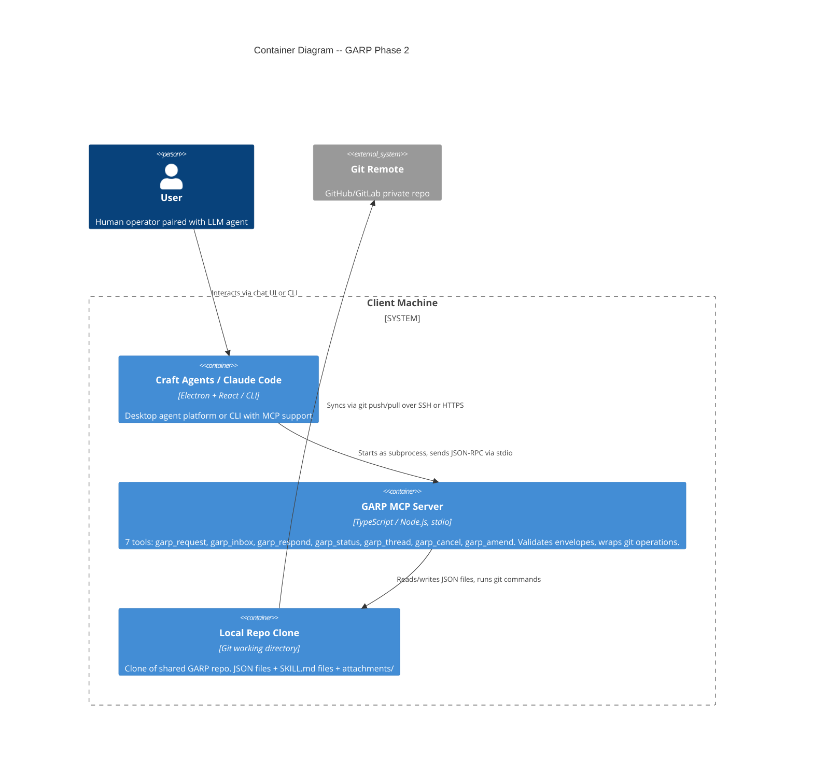

# Architecture Design -- GARP Phase 2 Polish

## System Overview

Phase 2 extends the GARP MCP server from 4 tools to 7, adds the `cancelled` lifecycle state, enhances inbox with thread grouping and attachment metadata, and adds 2 new skill contracts. All changes remain in Tier 1 (local MCP server + git repo). No new dependencies. No architecture style changes.

**Scope**: 3 new tools, 4 modified tools, 2 skill contracts, 1 convention document.

---

## Design Decision Resolutions

### DD-1: Thread Grouping Algorithm for Inbox (US-011)

**Decision**: Group by `thread_id` within the pending scan results only. A thread group appears when 2+ pending requests share a `thread_id`. Threads-of-one and requests without `thread_id` display as standalone items.

**Algorithm**:
1. Scan `pending/`, filter by `recipient == userId` (existing behavior)
2. Build a `Map<thread_id, InboxEntry[]>` from filtered results
3. For entries where `thread_id` is absent: treat as standalone (key = `request_id`)
4. For groups with 1 entry: emit as standalone `InboxEntry`
5. For groups with 2+ entries: emit as `InboxThreadGroup` with aggregated fields
6. Sort all items by the latest `created_at` within each group

**Thread group fields**: `thread_id`, `request_type`, `sender` (from latest), `round_count`, `latest_summary`, `latest_created_at`, `request_ids[]`, `skill_path`, `attachment_count` (sum), optional `attachments`.

**Bidirectional threads** (e.g., design-skill where both parties send): Inbox only scans for `recipient == userId`, so it only surfaces pending requests addressed to the current user. If Cory sends round 1 to Dan and Dan sends round 2 to Cory, each user sees only the requests addressed to them. Thread grouping groups those by `thread_id`. This handles the bidirectional case naturally because each user's inbox only contains their own pending items.

**Pre-Phase-2 requests**: Requests without `thread_id` are assigned a synthetic grouping key of their own `request_id`, ensuring they always appear standalone. No errors.

**Rationale**: Grouping only within pending/ keeps the algorithm simple (single directory scan, which already happens). No cross-directory joins needed. The agent can use `garp_thread` for full history when needed.

### DD-2: Amendment Visibility in Inbox (US-014)

**Decision**: Add an `amendment_count: number` field to `InboxEntry`. Default 0. Populated from `envelope.amendments?.length ?? 0`.

**Rationale**: Minimal surface area. The agent sees "this request was amended 2 times" during triage and can call `garp_status` for details. A boolean loses the count. Full amendment rendering in inbox adds too much data to a triage view. The count follows the same pattern as `attachment_count`.

### DD-3: garp_thread Output Format (US-009)

**Decision**: Full envelopes + full responses. Each thread entry is `{ request: RequestEnvelope, response?: ResponseEnvelope }`. Thread-level summary is a sibling object.

**Output shape**:
```
{
  thread_id: string,
  summary: {
    participants: string[],     // user_ids of all senders + recipients
    round_count: number,
    latest_status: string,
    request_type: string
  },
  entries: [
    { request: <full envelope>, response?: <full response envelope> },
    ...
  ],
  warning?: string
}
```

**Rationale**: Full envelopes are simpler to implement (read file, return it) and avoid a new data shape. The agent always has complete context. Token cost is acceptable at MVP scale (dozens of requests per thread, not thousands). A summary-only mode can be added later as an optional `format` parameter if needed.

### DD-4: Cancelled Directory Initialization (US-013)

**Decision**: Add `.gitkeep` to `requests/cancelled/` in `garp-init.sh`. Match existing convention.

**Rationale**: `pending/`, `active/`, `completed/` all have `.gitkeep` created by `garp-init.sh`. The cancelled directory should follow the same pattern. Creating on first cancel would cause a `listDirectory` error in `garp_status` when scanning cancelled/ before any cancel has occurred (the directory would not exist). Adding `.gitkeep` avoids conditional directory-existence checks throughout the codebase.

**Migration**: Existing repos need `mkdir -p requests/cancelled && touch requests/cancelled/.gitkeep && git add requests/cancelled/.gitkeep && git commit -m "Add cancelled directory"`. Document in release notes.

### DD-5: garp_cancel and garp_amend Parameter Schemas (US-013, US-014)

**garp_cancel parameters**:
```
request_id: z.string()    -- required, the request to cancel
reason: z.string().optional()  -- optional, why the sender is cancelling
```

The `reason` is stored in the request envelope as `cancel_reason` alongside the status update. This provides audit context ("sent to wrong person", "figured it out myself") without requiring a separate data structure. When absent, no reason field is added.

**garp_amend parameters**:
```
request_id: z.string()    -- required, the request to amend
fields: z.record(z.string(), z.any())  -- required, the additional context to append
note: z.string().optional()  -- optional, human-readable description of the amendment
```

`fields` is a flexible key-value record matching the `context_bundle` pattern. It is NOT merged into `context_bundle`; it is appended to the `amendments` array as a discrete entry with timestamp.

**Amendment entry shape** (appended to `amendments[]` array on the envelope):
```
{
  amended_at: string,       // ISO 8601
  amended_by: string,       // user_id
  fields: Record<string, unknown>,
  note?: string
}
```

### DD-6: Cancelled Status in GarpStatusResult (US-015)

**Decision**: Add `"cancelled"` to the `GarpStatusResult.status` union type: `"pending" | "active" | "completed" | "cancelled"`.

**garp_status behavior for cancelled requests**: Return `{ status: "cancelled", request: <envelope> }` with no `response` field. Cancel is pending-only so no response can exist. The envelope will contain `status: "cancelled"` (set by garp_cancel before move) and optionally `cancel_reason`.

**Scan order in garp_status**: Add `requests/cancelled/` as a fourth directory to scan. Scan order: pending -> active -> completed -> cancelled. The cancelled check is last because it is the least common lookup.

---

## C4 System Context (Level 1)

No changes from Phase 1. The system boundary, actors, and external systems remain identical. Phase 2 adds internal capabilities, not external integrations.

---

## C4 Container (Level 2) -- Updated



### Container Changes from Phase 1
- MCP Server: 4 tools -> 7 tools
- Container description updated to list all 7 tools
- Craft Agents container updated to include Claude Code as a host option

---

## C4 Component (Level 3) -- Tool Handlers

The system has grown from ~675 lines to an estimated ~1,260+ lines across 14+ source files, warranting a component diagram.

```mermaid
C4Component
    title Component Diagram -- GARP MCP Server

    Container_Boundary(mcp, "GARP MCP Server") {

        Component(mcpReg, "MCP Registration", "mcp-server.ts", "Registers 7 tools with Zod parameter schemas, routes JSON-RPC calls to handlers")
        Component(serverFactory, "Server Factory", "server.ts", "Creates adapter instances, dispatches tool calls to handlers")
        Component(entrypoint, "Stdio Entry", "index.ts", "Env var loading, MCP transport setup")

        Component(toolRequest, "garp_request", "tools/garp-request.ts", "Validates, builds envelope with auto thread_id, writes attachment files, commits + pushes")
        Component(toolInbox, "garp_inbox", "tools/garp-inbox.ts", "Pulls, scans pending, groups by thread_id, returns summaries with attachment metadata")
        Component(toolRespond, "garp_respond", "tools/garp-respond.ts", "Validates recipient, updates status to completed, writes response, git mv, commits + pushes")
        Component(toolStatus, "garp_status", "tools/garp-status.ts", "Pulls, searches pending/active/completed/cancelled, returns status + request + response + attachment paths")
        Component(toolThread, "garp_thread", "tools/garp-thread.ts", "Pulls, scans all directories for thread_id matches, pairs with responses, returns chronological history")
        Component(toolCancel, "garp_cancel", "tools/garp-cancel.ts", "Validates sender, updates status to cancelled, git mv to cancelled/, commits + pushes")
        Component(toolAmend, "garp_amend", "tools/garp-amend.ts", "Validates sender + pending, appends amendment entry, rewrites envelope, commits + pushes")

        Component(schemas, "Schemas", "schemas.ts", "Zod schemas: RequestEnvelope, ResponseEnvelope, AmendmentEntry, TeamConfig")
        Component(ports, "Port Interfaces", "ports.ts", "GitPort, ConfigPort, FilePort")
        Component(reqId, "Request ID", "request-id.ts", "Generates req-YYYYMMDD-HHmmss-userId-hex4")
        Component(logger, "Logger", "logger.ts", "Structured JSON to stderr")

        Component(gitAdapter, "Git Adapter", "adapters/git-adapter.ts", "simple-git wrapper with pull-rebase retry")
        Component(configAdapter, "Config Adapter", "adapters/config-adapter.ts", "Reads config.json, resolves team members")
        Component(fileAdapter, "File Adapter", "adapters/file-adapter.ts", "JSON read/write, directory listing, file move")
    }

    Rel(entrypoint, mcpReg, "Creates MCP server")
    Rel(mcpReg, toolRequest, "Routes garp_request calls")
    Rel(mcpReg, toolInbox, "Routes garp_inbox calls")
    Rel(mcpReg, toolRespond, "Routes garp_respond calls")
    Rel(mcpReg, toolStatus, "Routes garp_status calls")
    Rel(mcpReg, toolThread, "Routes garp_thread calls")
    Rel(mcpReg, toolCancel, "Routes garp_cancel calls")
    Rel(mcpReg, toolAmend, "Routes garp_amend calls")

    Rel(toolRequest, gitAdapter, "Commits and pushes request")
    Rel(toolRequest, configAdapter, "Validates sender and recipient")
    Rel(toolRequest, fileAdapter, "Writes envelope and attachment files")
    Rel(toolRequest, reqId, "Generates request_id")

    Rel(toolInbox, gitAdapter, "Pulls latest")
    Rel(toolInbox, fileAdapter, "Lists and reads pending directory")

    Rel(toolRespond, gitAdapter, "Commits response + moves request")
    Rel(toolRespond, configAdapter, "Looks up responder")
    Rel(toolRespond, fileAdapter, "Writes response, reads/writes request envelope")

    Rel(toolStatus, gitAdapter, "Pulls latest")
    Rel(toolStatus, fileAdapter, "Searches directories, reads envelopes")

    Rel(toolThread, gitAdapter, "Pulls latest")
    Rel(toolThread, fileAdapter, "Scans all directories, reads envelopes + responses")

    Rel(toolCancel, gitAdapter, "Pulls, commits, pushes, moves")
    Rel(toolCancel, fileAdapter, "Reads/writes envelope, lists directories")

    Rel(toolAmend, gitAdapter, "Pulls, commits, pushes")
    Rel(toolAmend, fileAdapter, "Reads/writes envelope, lists directories")
```



---

## Request Lifecycle -- Updated

```
                    +------------------+
                    |   garp_request   |
                    +--------+---------+
                             |
                             v
                    +--------+---------+
                    |    pending/      |
                    +--+-----+-----+--+
                       |     |     |
          garp_respond |     |     | garp_cancel
          (recipient)  |     |     | (sender)
                       v     |     v
              +--------+--+  |  +--+-----------+
              | completed/|  |  |  cancelled/  |
              +-----------+  |  +--------------+
                             |
                   garp_amend (sender)
                   modifies in-place
                   stays in pending/
```

**State transitions**:
| From | To | Tool | Gate |
|------|----|------|------|
| (new) | pending | garp_request | Sender in config, recipient in config, skill exists |
| pending | completed | garp_respond | Caller is recipient |
| pending | cancelled | garp_cancel | Caller is sender |
| pending | pending (amended) | garp_amend | Caller is sender |

**Illegal transitions** (return errors):
- completed -> cancelled (already completed)
- completed -> amended (already completed)
- cancelled -> completed (not found in pending)
- cancelled -> cancelled (already cancelled)
- cancelled -> amended (already cancelled)

---

## Updated Data Models

### RequestEnvelope Schema Changes

Add to `RequestEnvelopeSchema`:
- `amendments`: `z.array(AmendmentEntrySchema).optional()` -- append-only amendment history
- `cancel_reason`: `z.string().optional()` -- reason for cancellation (set by garp_cancel)

New schema:
```
AmendmentEntrySchema = z.object({
  amended_at: z.string(),        // ISO 8601
  amended_by: z.string(),        // user_id
  fields: z.record(z.string(), z.unknown()),
  note: z.string().optional(),
})
```

### GarpStatusResult Changes

```
status: "pending" | "active" | "completed" | "cancelled"
request: unknown
response?: unknown
attachment_paths?: Array<{ filename: string, description: string, path: string }>
warning?: string
```

### InboxEntry Changes

Add fields:
- `attachments?: Array<{ filename: string, description: string }>` -- attachment metadata for triage
- `amendment_count: number` -- count of amendments (0 if none)

### InboxThreadGroup (New Type)

When 2+ pending requests share a `thread_id`:
```
{
  is_thread_group: true,
  thread_id: string,
  request_type: string,
  sender: string,
  round_count: number,
  latest_request_id: string,
  latest_short_id: string,
  latest_summary: string,
  created_at: string,            // latest round's created_at
  request_ids: string[],
  skill_path: string,
  attachment_count: number,      // sum across all rounds
  amendment_count: number,       // sum across all rounds
}
```

### InboxResult Changes

```
{
  requests: Array<InboxEntry | InboxThreadGroup>,
  warning?: string
}
```

### garp_request Return Value Change

Add `thread_id` to the return value:
```
{ request_id: string, thread_id: string, status: string, message: string }
```

---

## Updated Repository Structure

```
garp-repo/
  config.json
  requests/
    pending/
      .gitkeep
    active/
      .gitkeep
    completed/
      .gitkeep
    cancelled/               <-- NEW
      .gitkeep               <-- NEW
  responses/
    .gitkeep
  attachments/               (created on demand by garp_request)
    {request_id}/
      {filename}
  skills/
    ask/SKILL.md
    design-skill/SKILL.md
    sanity-check/SKILL.md    <-- NEW
    code-review/SKILL.md     <-- NEW
```

---

## Technology Decisions

**Confirmed: No new dependencies.** All 10 stories use the existing stack:
- TypeScript (MIT)
- Zod 4 (MIT) -- AmendmentEntrySchema uses existing patterns
- simple-git 3.x (MIT) -- no new git operations needed
- @modelcontextprotocol/sdk (MIT) -- 3 new tool registrations follow existing pattern
- Vitest 4.x (MIT) -- new tests follow existing patterns
- esbuild (MIT) -- no build changes needed

---

## Integration Points

### server.ts Changes

Add 3 new `case` branches to `callTool` dispatcher:
- `"garp_thread"` -> `handleGarpThread`
- `"garp_cancel"` -> `handleGarpCancel`
- `"garp_amend"` -> `handleGarpAmend`

New tools need `ConfigPort` for sender validation (cancel, amend) but NOT for recipient lookup. Context type for cancel/amend: `{ userId, repoPath, git, config, file }`. Context type for thread: `{ userId, repoPath, git, file }`.

### mcp-server.ts Changes

Add 3 new `server.tool()` registrations following the existing pattern (description, Zod params, async handler with ensureAdapters/formatResult/formatError).

### garp-init.sh Changes

Add `requests/cancelled` to the `mkdir -p` list and to the `.gitkeep` loop.

---

## Quality Attribute Strategies (Phase 2 Additions)

### Maintainability
- New tools follow identical handler pattern (params interface, context interface, async handler function)
- Amendment data model is append-only, avoiding mutation complexity
- Thread grouping logic is isolated within `handleGarpInbox`, not spread across tools

### Testability
- Cancel and amend share the sender-validation and pending-only gate patterns with respond
- Thread tool is read-only, simplest to test (setup fixtures, assert output)
- Amendment append-only design means each test can independently verify array contents

### Reliability
- Status field consistency (US-015) eliminates the JSON-directory mismatch bug
- garp_cancel + garp_amend both pull before operating, matching the pull-first convention
- Cancelled directory existence guaranteed by garp-init.sh convention

### Backward Compatibility
- `thread_id` remains optional in `RequestEnvelopeSchema` (existing envelopes without it parse fine)
- `amendments` is optional (existing envelopes without it parse fine)
- `cancel_reason` is optional
- Inbox handles missing `thread_id` by treating it as standalone
- garp_status scans cancelled/ with graceful handling if directory is empty

---

## Roadmap Implementation Order

### Wave 1: Thread Foundation (2-3 days)

| Step | Story | Description | New/Modified Files |
|------|-------|-------------|-------------------|
| 1 | US-010 | Auto-assign thread_id = request_id when not provided; add thread_id to return value | garp-request.ts, mcp-server.ts (return shape) |
| 2 | US-009 | New garp_thread tool: scan all dirs for thread_id, pair with responses, return chronological history | garp-thread.ts (new), server.ts, mcp-server.ts |
| 3 | US-011 | Thread-aware inbox: group pending by thread_id, emit InboxThreadGroup for multi-request threads | garp-inbox.ts |

### Wave 2: Lifecycle + Attachments (3-4 days)

| Step | Story | Description | New/Modified Files |
|------|-------|-------------|-------------------|
| 4 | US-013 + US-015 partial | garp_cancel tool + status field update; add cancelled/ to init script; scan cancelled/ in status | garp-cancel.ts (new), garp-status.ts, server.ts, mcp-server.ts, garp-init.sh, schemas.ts |
| 5 | US-014 + US-015 partial | garp_amend tool + AmendmentEntry schema; add amendment_count to inbox | garp-amend.ts (new), schemas.ts, garp-inbox.ts, server.ts, mcp-server.ts |
| 6 | US-015 remainder | garp_respond status field consistency (set status = "completed" before move) | garp-respond.ts |
| 7 | US-012 | Attachment metadata in inbox, attachment paths in status | garp-inbox.ts, garp-status.ts |

### Wave 3: Skills + Convention (1-2 days)

| Step | Story | Description | New/Modified Files |
|------|-------|-------------|-------------------|
| 8 | US-017 | Sanity-check SKILL.md | examples/skills/sanity-check/SKILL.md |
| 9 | US-018 | Code-review SKILL.md | examples/skills/code-review/SKILL.md |
| 10 | US-016 | Inbox auto-poll convention doc | docs/ convention document |

**Batching notes**: US-013 and US-015 are partially merged in step 4 because garp_cancel naturally implements status="cancelled" before move. The garp_respond portion of US-015 is step 6 (tiny change, separate commit). US-017 and US-018 are both SKILL.md files but differ in complexity (sanity-check is simpler, code-review exercises attachments), so they remain separate steps.

---

## Handoff to Acceptance Designer

This architecture document provides:
- All 6 design decisions resolved with rationale
- Updated data models with exact schema shapes
- Component boundaries (new files, modified files, dependency order)
- Updated C4 diagrams (Container L2, Component L3)
- Updated request lifecycle including cancelled state
- Integration points for server.ts and mcp-server.ts
- 10-step implementation order with wave grouping
- ADRs for thread grouping and amendment data model (see /docs/adrs/)

The acceptance designer can produce step-level acceptance tests for the 10-step roadmap.
