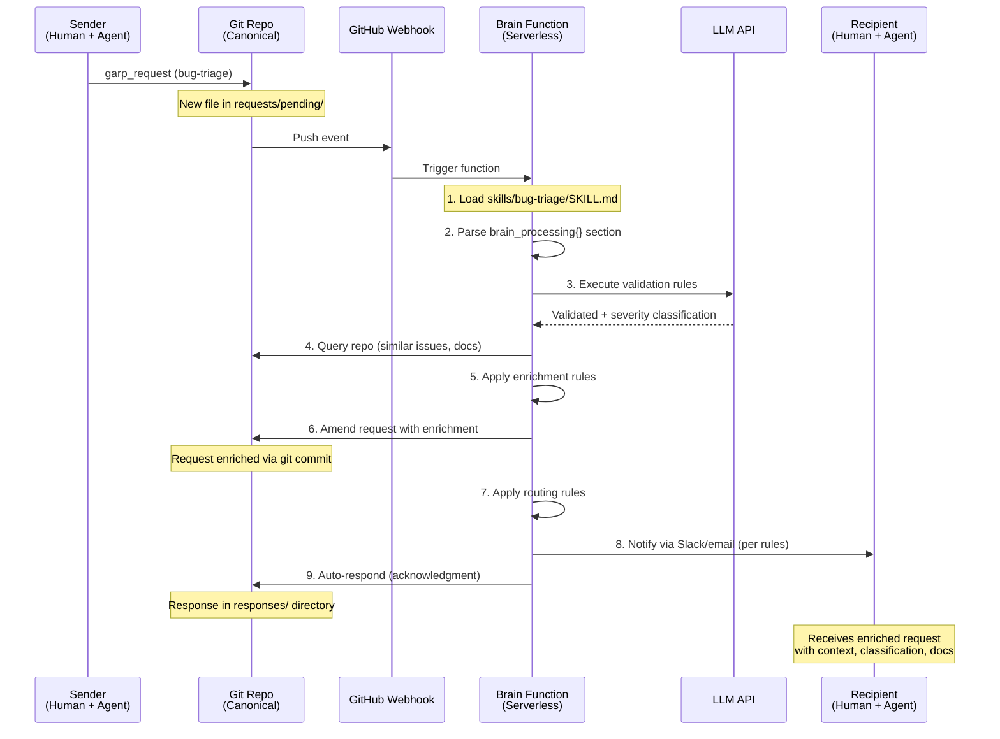

# Tier 2 Brain Architecture: Lessons from Beads Evolution

**Date**: 2026-02-22
**Context**: Strategic architecture discussion following Beads migration study (v0.49 → v0.55)
**Status**: Research & Design
**Related**: [Beads Ecosystem Analysis](./beads-ecosystem-analysis.md)

---

## Executive Summary

This document captures a critical architectural insight for GARP's Tier 2 "brain service" evolution, informed by studying Beads' 8-phase refactoring that removed ~16,000 lines of legacy code. The key finding: **the brain should be skill-driven serverless orchestration, not a stateful daemon**.

**What the brain IS**:
- Serverless functions triggered by git events
- Reads SKILL.md contracts to determine behavior
- Executes validation, enrichment, routing per skill
- Writes results back to git (stateless, idempotent)
- Optional per skill, team-configurable

**What the brain is NOT**:
- A stateful daemon managing connections
- A database sync layer
- A central coordination service
- A replacement for git as canonical storage

---

## Background: Beads' Evolution (v0.49 → v0.55)

### What Beads Removed

Between February 14-20, 2026, Beads underwent a massive refactoring that **deleted ~16,000 lines** of code:

| Component | Lines Removed | Why It Failed |
|-----------|---------------|---------------|
| **SQLite backend** | ~4,000 | Couldn't provide git-like version control |
| **JSONL sync pipeline** | ~11,000 | Eventual consistency hell, merge conflicts |
| **Daemon infrastructure** | ~3,000 | State management complexity, lock contention |
| **3-way merge engine** | ~1,000 | Custom conflict resolution, brittle |
| **Tombstone system** | ~500 | Soft deletes added complexity |
| **Storage factory** | ~500 | Abstraction over dual backends was maintenance burden |

### What Beads Kept

After the refactoring (v0.55.4):
- ✅ **Dolt database** - Git semantics + SQL queries + version control
- ✅ **Embedded mode** - Simple, zero-config, single-process
- ✅ **Server mode** - Optional, for multi-user concurrent access
- ✅ **Federation** - Dolt remotes for peer-to-peer sync
- ✅ **No daemon** - Direct database access, simpler debugging

### Key Lesson

**Complexity added early to solve scaling problems often requires fundamental backend changes later.** All the daemon/sync/dual-backend complexity was built to make SQLite scale, but ultimately the solution was replacing SQLite entirely with Dolt.

**Implication for GARP**: Don't add complexity (stateful services, sync layers) until the fundamental storage layer proves insufficient. Git → Dolt is a known migration path. Don't build complexity on top of git that will need to be removed later.

---

## Initial Misunderstanding: Brain as Daemon

### What Was Initially Assumed (❌)

The "Tier 2 brain service" sounded like it would be:
- A **central always-on service** watching the git repo
- Managing state (notifications, request tracking)
- Coordinating between clients
- Owning a database (SQLite? Dolt?) for indexing/search
- Syncing state between git and database

This pattern mirrors Beads' daemon, which was ultimately removed.

### Why This Would Be Bad

Following Beads' experience:
1. **State synchronization** - Brain database vs git repo requires sync layer
2. **Failure modes** - Brain crash = lost notifications, corrupted state
3. **Coordination complexity** - Multiple brains (multi-user) need to coordinate
4. **Lock contention** - Brain accessing repo during human git operations
5. **Eventual deletion** - Like Beads' daemon, would likely be removed later

---

## Actual Vision: Skill-Driven Orchestration

### The Critical Clarification

The "brain" is not a daemon. It's **serverless orchestration driven by SKILL.md contracts**.

> "The 'brain' is essentially just a server-side or 'switchboard operator' LLM that's sitting in between the human initiated GARP request and it reaching the recipient. Basically 'server-side processing' that's contextually handled based on the same skill contract for the request type as the humans are using."

### Core Principles

1. **Skill contract is executable** - Both humans and LLMs follow the same SKILL.md
2. **Stateless processing** - Functions triggered by git events, no persistent state
3. **Git remains canonical** - Brain writes enrichments back to git
4. **Skill-specific** - Each skill defines its own brain processing (or none)
5. **Team-configurable** - Skills live in team repos, teams control behavior

---

## Architecture: Skill-Driven Brain

### How It Works



### Example: Bug Triage Skill with Brain Processing

```markdown
# skills/bug-triage/SKILL.md

## Request Context Bundle

| Field | Type | Required | Description |
|-------|------|----------|-------------|
| `customer_name` | string | yes | Customer reporting the issue |
| `severity` | enum | yes | "low" \| "medium" \| "high" \| "critical" |
| `component` | enum | yes | "frontend" \| "backend" \| "infrastructure" |
| `description` | string | yes | Bug description |
| `reproduction_steps` | string | yes | Steps to reproduce |

## Brain Processing (Server-Side)

This section defines automated processing that occurs when a request is submitted.

### Validation

- **Check completeness**: Verify all required fields present
- **Customer validation**: Verify customer exists in CRM (Salesforce API)
- **Severity classification**: LLM validates severity matches impact
  - Prompt: "Given this bug description, is severity '{severity}' appropriate?
    Consider: user impact, data risk, system availability."
  - If mismatch detected, flag for human review

### Enrichment

- **GitHub similar issues**:
  - Semantic search across open/closed issues
  - Attach top 3 most similar issues with links
  - Include resolution if closed

- **Slack history**:
  - Search #support and #engineering for mentions of component
  - Lookback: 30 days
  - Attach relevant thread links

- **Documentation**:
  - Query knowledge base for component
  - Attach debugging guides, architecture docs

- **Effort estimation**:
  - LLM prediction based on description and similar issues
  - Prompt: "Based on this bug and similar resolved issues, estimate effort in hours."

### Routing Rules

```yaml
routing:
  - condition: severity == "critical"
    actions:
      - notify_slack:
          channel: "#incidents"
          mention: "@channel"
      - notify_oncall: true
      - set_sla_hours: 4
      - cc_account_manager: true  # if enterprise customer

  - condition: component == "frontend"
    actions:
      - add_watchers: ["@frontend-team"]
      - attach_file: "guides/frontend-debugging.md"
      - assign_default: "frontend-on-call"

  - condition: component == "backend"
    actions:
      - add_watchers: ["@backend-team"]
      - attach_file: "guides/backend-debugging.md"

  - condition: customer.tier == "enterprise"
    actions:
      - escalate_to: "senior-engineer"
      - notify_account_manager: true
      - set_sla_hours: 4

  - default:
      - set_sla_hours: 24
```

### Auto-Response

```yaml
auto_response:
  enabled: true
  template: |
    ## Request Acknowledged

    Your bug report has been received and processed.

    **Assignment**: {assigned_team}
    **SLA**: {sla_hours} hours
    **Estimated Effort**: {estimated_hours} hours

    **Related Issues**:
    {similar_issues_list}

    **Attached Resources**:
    {attached_docs_list}

    You will be notified when investigation begins.
```

## Expected Response (Human)

When responding to this request, provide:

| Field | Type | Required | Description |
|-------|------|----------|-------------|
| `root_cause` | string | yes | Root cause analysis |
| `fix_description` | string | yes | How the bug was fixed |
| `prevention` | string | no | How to prevent similar bugs |
| `affected_versions` | string[] | yes | Which versions are affected |
| `fix_pr_url` | string | yes | Pull request with the fix |
```

---

## Implementation Architecture

### Tech Stack

| Component | Technology | Rationale |
|-----------|-----------|-----------|
| **Trigger** | GitHub Webhooks | Native git integration, free |
| **Functions** | AWS Lambda / Vercel / Cloudflare Workers | Serverless, auto-scale, pay-per-use |
| **LLM** | Anthropic Claude API | Skill contract understanding, classification |
| **Storage** | Git repo (canonical) | No separate database, single source of truth |
| **Notifications** | Slack API / SendGrid / Twilio | Per-skill routing configuration |

### Serverless Function Structure

```typescript
// brain/functions/process-request.ts

import { Octokit } from '@octokit/rest';
import Anthropic from '@anthropic-ai/sdk';
import { parseSkillContract } from '../lib/skill-parser';
import { executeValidation, executeEnrichment, executeRouting } from '../lib/processors';

interface GitHubWebhookEvent {
  repository: { clone_url: string };
  commits: Array<{
    added: string[];
    modified: string[];
  }>;
}

export default async function handler(event: GitHubWebhookEvent) {
  // 1. Parse the webhook event
  const newRequests = extractNewRequests(event);

  for (const requestPath of newRequests) {
    // 2. Clone repo (shallow, lightweight)
    const repo = await cloneRepo(event.repository.clone_url);

    // 3. Load request envelope
    const request = await loadRequest(repo, requestPath);

    // 4. Load skill contract
    const skillPath = `${repo}/skills/${request.request_type}/SKILL.md`;
    const skill = await parseSkillContract(skillPath);

    // Skip if skill has no brain processing
    if (!skill.brain_processing) {
      console.log(`Skill ${request.request_type} has no brain processing`);
      return;
    }

    // 5. Execute brain processing stages
    const processor = new SkillProcessor(skill, request);

    try {
      // Validation
      const validationResult = await processor.validate();
      if (!validationResult.valid) {
        await flagForReview(repo, request, validationResult.errors);
        return;
      }

      // Enrichment
      const enrichment = await processor.enrich();
      await amendRequest(repo, request, enrichment);

      // Routing
      await processor.route();

      // Auto-response
      if (skill.brain_processing.auto_response?.enabled) {
        await autoRespond(repo, request, enrichment);
      }

      // Commit and push enrichments back to git
      await commitAndPush(repo, `[brain] Processed ${request.request_id}`);

    } catch (error) {
      console.error(`Brain processing failed for ${request.request_id}:`, error);
      await notifyError(request, error);
    }
  }
}

class SkillProcessor {
  constructor(
    private skill: SkillContract,
    private request: RequestEnvelope
  ) {}

  async validate(): Promise<ValidationResult> {
    const rules = this.skill.brain_processing.validation || [];

    for (const rule of rules) {
      if (rule.llm_classify_severity) {
        const result = await this.llmValidateSeverity();
        if (!result.valid) {
          return { valid: false, errors: [result.error] };
        }
      }

      if (rule.check_required_fields) {
        const missing = this.checkRequiredFields(rule.check_required_fields);
        if (missing.length > 0) {
          return { valid: false, errors: [`Missing fields: ${missing.join(', ')}`] };
        }
      }

      if (rule.verify_customer_in_crm) {
        const exists = await this.verifyCRM(this.request.context_bundle.customer_name);
        if (!exists) {
          return { valid: false, errors: ['Customer not found in CRM'] };
        }
      }
    }

    return { valid: true };
  }

  async enrich(): Promise<Enrichment> {
    const rules = this.skill.brain_processing.enrichment || [];
    const enrichment: Enrichment = {
      similar_issues: [],
      slack_threads: [],
      docs: [],
      estimated_hours: null,
    };

    for (const rule of rules) {
      if (rule.github_similar_issues) {
        enrichment.similar_issues = await this.findSimilarIssues(rule.github_similar_issues);
      }

      if (rule.slack_history) {
        enrichment.slack_threads = await this.searchSlack(rule.slack_history);
      }

      if (rule.attach_docs) {
        enrichment.docs = await this.findDocs(rule.attach_docs);
      }

      if (rule.estimate_effort) {
        enrichment.estimated_hours = await this.llmEstimateEffort();
      }
    }

    return enrichment;
  }

  async route(): Promise<void> {
    const rules = this.skill.brain_processing.routing || [];

    for (const rule of rules) {
      const conditionMet = this.evaluateCondition(rule.condition);
      if (conditionMet) {
        await this.executeActions(rule.actions);
      }
    }
  }

  private async llmValidateSeverity(): Promise<{ valid: boolean; error?: string }> {
    const anthropic = new Anthropic({ apiKey: process.env.ANTHROPIC_API_KEY });

    const result = await anthropic.messages.create({
      model: 'claude-3-5-sonnet-20241022',
      max_tokens: 256,
      messages: [{
        role: 'user',
        content: `Given this bug description: "${this.request.context_bundle.description}"

Is the severity "${this.request.context_bundle.severity}" appropriate?
Consider: user impact, data risk, system availability.

Respond with VALID if appropriate, or INVALID: <reason> if not.`
      }],
    });

    const response = result.content[0].text;
    if (response.startsWith('VALID')) {
      return { valid: true };
    } else {
      return { valid: false, error: response };
    }
  }

  private async findSimilarIssues(config: any): Promise<SimilarIssue[]> {
    // Semantic search using embeddings
    // Query GitHub API for similar issues
    // Return top 3 matches
  }

  private async executeActions(actions: RoutingAction[]): Promise<void> {
    for (const action of actions) {
      if (action.notify_slack) {
        await notifySlack(action.notify_slack);
      }
      if (action.notify_oncall) {
        await notifyOncall(this.request);
      }
      if (action.set_sla_hours) {
        await setSLA(this.request, action.set_sla_hours);
      }
      // ... more action types
    }
  }
}
```

### GitHub Actions Integration

```yaml
# .github/workflows/garp-brain.yml
name: GARP Brain Processing

on:
  push:
    paths:
      - 'requests/pending/**'
    branches:
      - main

jobs:
  process-requests:
    runs-on: ubuntu-latest
    steps:
      - name: Checkout repo
        uses: actions/checkout@v4
        with:
          fetch-depth: 0  # Full history for enrichment queries

      - name: Setup Node.js
        uses: actions/setup-node@v4
        with:
          node-version: '20'

      - name: Install dependencies
        run: |
          cd brain
          npm ci

      - name: Process new requests
        env:
          ANTHROPIC_API_KEY: ${{ secrets.ANTHROPIC_API_KEY }}
          SLACK_BOT_TOKEN: ${{ secrets.SLACK_BOT_TOKEN }}
          GITHUB_TOKEN: ${{ secrets.GITHUB_TOKEN }}
        run: |
          node brain/process-pending.js

      - name: Commit enrichments
        run: |
          git config user.name "GARP Brain"
          git config user.email "brain@garp.dev"
          git add -A
          git diff --staged --quiet || git commit -m "[brain] Processed new requests"
          git push
```

---

## Comparison: Daemon vs Skill-Driven

| Aspect | Daemon Pattern (Beads v0.49) | Skill-Driven Brain (GARP Tier 2) |
|--------|------------------------------|----------------------------------|
| **State** | Stateful (DB, locks, queues) | Stateless (triggered functions) |
| **Lifecycle** | Always-on process | Event-triggered, ephemeral |
| **Configuration** | Hardcoded logic in daemon code | Declarative rules in SKILL.md |
| **Coupling** | Tight (daemon owns coordination) | Loose (skill contracts define behavior) |
| **Scaling** | Server capacity limits | Serverless auto-scale |
| **Failure Mode** | Lost state, DB corruption | Retry function, idempotent |
| **Testing** | Complex (need running daemon) | Simple (unit test functions) |
| **Deployment** | Server provisioning, monitoring | Deploy functions, no ops |
| **Customization** | Code changes, redeploy daemon | Edit SKILL.md, commit to git |
| **Multi-team** | Shared daemon config | Per-team skill contracts |
| **Version Control** | Config in DB or files | Skills in git, full history |

---

## Why This Avoids Beads' Mistakes

### 1. No State Synchronization

**Beads' problem**: Daemon had state (in-memory, SQLite) that had to sync with JSONL files.

**GARP solution**: Brain functions write directly to git. Git is the only state. No sync needed.

### 2. No Dual Backend

**Beads' problem**: Supported both SQLite and Dolt, complex factory pattern, test matrix explosion.

**GARP solution**: Git is canonical. Brain enriches git. No separate backend. Later migration to Dolt (if needed) is a backend swap, not a dual-support scenario.

### 3. No Always-On Process

**Beads' problem**: Daemon lifecycle management, crash recovery, lock contention.

**GARP solution**: Serverless functions. No process to manage. Triggered by git events. Crash = retry, not lost state.

### 4. Skill-Specific, Not Global

**Beads' problem**: Daemon had global logic. Adding new behavior meant code changes.

**GARP solution**: Each skill defines its own brain processing (or none). New behavior = new skill, zero code changes to brain infrastructure.

### 5. Team-Configurable

**Beads' problem**: Central daemon config affects all users.

**GARP solution**: Skills live in team repos. Team A's bug-triage skill can differ from Team B's. Each team controls their workflow.

---

## Skill Contract Schema Extensions

### Brain Processing Section

```yaml
# Part of SKILL.md (YAML frontmatter or dedicated section)

brain_processing:

  # Validation rules (executed first)
  validation:
    - llm_classify_severity: true
      prompt_template: |
        Given this bug description: "{description}"
        Is severity "{severity}" appropriate?
        Consider: user impact, data risk, system availability.
        Respond VALID or INVALID: <reason>.

    - check_required_fields:
        - customer_name
        - description
        - reproduction_steps

    - verify_customer_in_crm:
        api: salesforce
        field: customer_name

  # Enrichment rules (executed after validation passes)
  enrichment:
    - github_similar_issues:
        repo: "acme/product"
        semantic_search: true
        limit: 3
        include_closed: true

    - slack_history:
        channels: ["#support", "#engineering"]
        lookback_days: 30
        search_term: "{component}"

    - attach_docs:
        knowledge_base: "docs/"
        query: "{component}"
        max_results: 5

    - llm_estimate_effort:
        prompt_template: |
          Based on this bug and {similar_issues_count} similar resolved issues:
          {similar_issues_summary}

          Estimate effort in hours.

  # Routing rules (executed after enrichment)
  routing:
    # Rules evaluated in order, all matching rules execute

    - condition: "severity == 'critical'"
      actions:
        - notify_slack:
            channel: "#incidents"
            mention: "@channel"
            template: "🚨 Critical bug: {request_id} from {customer_name}"

        - notify_oncall:
            service: pagerduty
            priority: high

        - set_sla_hours: 4

        - cc_account_manager:
            condition: "customer.tier == 'enterprise'"

    - condition: "component == 'frontend'"
      actions:
        - add_watchers: ["@frontend-team"]
        - attach_file: "guides/frontend-debugging.md"
        - assign_default: "frontend-on-call"

    - condition: "component == 'backend'"
      actions:
        - add_watchers: ["@backend-team"]
        - attach_file: "guides/backend-debugging.md"
        - assign_default: "backend-on-call"

    - default: true  # Always execute
      actions:
        - set_sla_hours: 24

  # Auto-response (executed last)
  auto_response:
    enabled: true
    delay_seconds: 60  # Wait 60s to batch enrichments
    template: |
      ## Request Acknowledged

      Your {request_type} request has been received and processed.

      **Assignment**: {assigned_team}
      **SLA**: {sla_hours} hours
      **Estimated Effort**: {estimated_hours} hours

      **Related Issues**:
      {#each similar_issues}
      - [{title}]({url}) - {status}
      {/each}

      **Attached Resources**:
      {#each attached_docs}
      - [{title}]({path})
      {/each}

      You will be notified when investigation begins.
```

### Skill Parser Updates

```typescript
// brain/lib/skill-parser.ts

interface SkillContract {
  // Existing fields
  request_type: string;
  description: string;
  context_bundle: ContextBundleSchema;
  expected_response: ResponseSchema;

  // New field for brain processing
  brain_processing?: {
    validation?: ValidationRule[];
    enrichment?: EnrichmentRule[];
    routing?: RoutingRule[];
    auto_response?: AutoResponseConfig;
  };
}

interface ValidationRule {
  llm_classify_severity?: {
    enabled: boolean;
    prompt_template: string;
  };
  check_required_fields?: string[];
  verify_customer_in_crm?: {
    api: string;
    field: string;
  };
}

interface EnrichmentRule {
  github_similar_issues?: {
    repo: string;
    semantic_search: boolean;
    limit: number;
    include_closed: boolean;
  };
  slack_history?: {
    channels: string[];
    lookback_days: number;
    search_term: string;
  };
  attach_docs?: {
    knowledge_base: string;
    query: string;
    max_results: number;
  };
  llm_estimate_effort?: {
    prompt_template: string;
  };
}

interface RoutingRule {
  condition: string | boolean;  // JavaScript expression or default: true
  actions: RoutingAction[];
}

interface RoutingAction {
  notify_slack?: { channel: string; mention?: string; template: string };
  notify_oncall?: { service: string; priority: string };
  set_sla_hours?: number;
  add_watchers?: string[];
  attach_file?: string;
  assign_default?: string;
}

interface AutoResponseConfig {
  enabled: boolean;
  delay_seconds?: number;
  template: string;
}

export function parseSkillContract(skillPath: string): SkillContract {
  // Parse SKILL.md frontmatter + body
  // Extract brain_processing section
  // Validate schema
  // Return typed contract
}
```

---

## Progressive Enhancement

### Level 1: No Brain Processing (Current)

```markdown
# skills/ask/SKILL.md

Simple question/answer workflow. No server-side processing needed.

## Request Context Bundle
- question: string
- urgency: "low" | "high"

## Expected Response
- answer: string
- references: string[]
```

No `brain_processing` section. Manual workflow only.

### Level 2: Auto-Acknowledgment

```markdown
# skills/ask/SKILL.md

brain_processing:
  auto_response:
    enabled: true
    delay_seconds: 30
    template: |
      Request received. Will respond within 24 hours.
```

Adds automatic acknowledgment. No validation or enrichment yet.

### Level 3: Validation + Routing

```markdown
# skills/code-review/SKILL.md

brain_processing:
  validation:
    - check_required_fields: ["diff_url", "language", "focus_areas"]

  routing:
    - condition: "language == 'typescript'"
      actions:
        - add_watchers: ["@frontend-team"]

    - condition: "language == 'python'"
      actions:
        - add_watchers: ["@backend-team"]

  auto_response:
    enabled: true
    template: "Code review assigned to {assigned_team}"
```

Adds validation and smart routing. Still lightweight.

### Level 4: Full Enrichment (Complex)

```markdown
# skills/bug-triage/SKILL.md

brain_processing:
  validation: [...]
  enrichment: [...]
  routing: [...]
  auto_response: [...]
```

Full brain processing as shown in earlier examples. For complex workflows.

---

## Deployment Tiers

### Tier 1: Manual Only (Current)
- No brain processing
- All workflows are human-driven
- Git repo + MCP server
- Zero infrastructure

### Tier 2a: GitHub Actions (Simple)
- Brain processing via GitHub Actions
- Triggered on push to requests/pending/
- Free for public repos, included in GitHub Team
- ~5 minutes latency (action startup)
- Good for: validation, simple enrichment, routing

### Tier 2b: Serverless Functions (Fast)
- Brain processing via AWS Lambda / Vercel / Cloudflare Workers
- Triggered by GitHub webhooks
- <5 second latency
- Pay-per-use pricing (~$5-50/month)
- Good for: complex enrichment, LLM calls, external API queries

### Tier 2c: Custom Deployment (Scale)
- Self-hosted brain service
- Kubernetes / Docker deployment
- Full control, custom integrations
- Good for: enterprise, high-volume, compliance requirements

---

## Cost Analysis

### GitHub Actions (Free Tier)

```
2,000 minutes/month free (public repos)
$0.008/minute after (private repos)

Typical request processing: 2 minutes
  - Checkout repo: 30s
  - Install deps: 45s
  - Process request: 30s
  - Commit + push: 15s

Capacity: 1,000 requests/month (free)
Cost at 5,000 requests/month: ~$20
```

### AWS Lambda

```
1M requests/month free
400,000 GB-seconds compute free

Typical request processing:
  - Memory: 512 MB
  - Duration: 5 seconds
  - Compute: 2.5 GB-seconds per request

Capacity: 160,000 requests/month (free)
Cost at 5,000 requests/month: $0 (within free tier)
Cost at 100,000 requests/month: ~$15
```

### LLM API Costs (Anthropic Claude)

```
Claude 3.5 Sonnet:
  - Input: $3 / 1M tokens
  - Output: $15 / 1M tokens

Typical request validation + classification:
  - Input: 500 tokens (skill contract + request)
  - Output: 100 tokens (validation result)
  - Cost: $0.0015 + $0.0015 = $0.003 per request

1,000 requests/month: $3
10,000 requests/month: $30
```

### Total Cost Estimates

| Volume | Infrastructure | LLM Calls | Total/Month |
|--------|----------------|-----------|-------------|
| 100 requests | GitHub Actions (free) | $0.30 | $0.30 |
| 1,000 requests | GitHub Actions (free) | $3 | $3 |
| 5,000 requests | AWS Lambda (free) | $15 | $15 |
| 10,000 requests | AWS Lambda ($5) | $30 | $35 |
| 50,000 requests | AWS Lambda ($50) | $150 | $200 |

**Conclusion**: Brain processing is extremely cost-effective. Even at significant scale (10k requests/month), total cost is ~$35/month.

---

## Migration Path

### Phase 1: Design (Current)
- Define brain_processing schema
- Update skill parser to handle new section
- Document examples

### Phase 2: GitHub Actions Prototype
- Build action that processes new requests
- Implement validation + auto-response
- Test with 1-2 skills

### Phase 3: Serverless Migration
- Port logic to Lambda/Vercel function
- Add webhook trigger
- Implement enrichment + routing

### Phase 4: LLM Integration
- Add Anthropic SDK
- Implement validation prompts
- Implement classification + estimation

### Phase 5: Full Feature Set
- Complete all enrichment types
- Complex routing rules
- Template rendering engine

---

## Open Questions

### 1. Skill Contract Format

**Question**: YAML frontmatter or dedicated section?

**Options**:
- A) YAML frontmatter (like Hugo, Jekyll)
  ```markdown
  ---
  brain_processing:
    validation: [...]
  ---

  # Skill Description
  ...
  ```

- B) Dedicated section in markdown
  ```markdown
  # Skill Description
  ...

  ## Brain Processing

  ```yaml
  validation: [...]
  ```

**Recommendation**: Start with (A) YAML frontmatter for parsability, allow (B) as alternative.

### 2. Condition Evaluation Language

**Question**: How to evaluate routing conditions?

**Options**:
- A) JavaScript expressions (`severity == "critical"`)
- B) JSON Logic (`{ "==": [{ "var": "severity" }, "critical"] }`)
- C) Simple key-value matching only

**Recommendation**: Start with (C) simple matching, add (A) JavaScript expressions for complex rules.

### 3. Enrichment Data Storage

**Question**: Where to store enrichment data?

**Options**:
- A) Amend request JSON (inline)
- B) Separate enrichment file (requests/enrichments/{id}.json)
- C) Attachments directory

**Recommendation**: (A) amend request JSON with enrichment object. Keeps all context in one file.

### 4. Error Handling

**Question**: What happens when brain processing fails?

**Options**:
- A) Fail silently, log error
- B) Add comment to request with error details
- C) Move request to requests/failed/ directory
- D) Notify skill author

**Recommendation**: (B) add comment with error, (D) notify skill author. Don't block human workflow.

### 5. Multi-Stage Processing

**Question**: Should brain processing support multiple stages?

**Example**:
```yaml
brain_processing:
  stages:
    - name: validate
      run: validation_rules

    - name: enrich
      depends_on: validate
      run: enrichment_rules

    - name: route
      depends_on: enrich
      run: routing_rules
```

**Recommendation**: Not for MVP. Implicit stage order (validate → enrich → route → respond) is sufficient.

---

## Success Metrics

| Metric | Target | Measurement |
|--------|--------|-------------|
| **Skill adoption** | 50% of skills use brain processing | Count skills with brain_processing{} |
| **Processing latency** | <30 seconds (GitHub Actions) | Time from push to enrichment commit |
| **Cost per request** | <$0.05 | LLM + infrastructure costs |
| **Error rate** | <1% | Failed brain processing / total requests |
| **Human override** | <5% | Requests where human edits brain output |
| **Notification accuracy** | >95% | Correct routing / total routed |

---

## References

### External

- [Beads Changelog v0.51-v0.55](https://github.com/steveyegge/beads/blob/main/CHANGELOG.md)
- [Dolt Documentation](https://docs.dolthub.com/)
- [GitHub Actions Webhooks](https://docs.github.com/en/actions/using-workflows/events-that-trigger-workflows)
- [AWS Lambda Pricing](https://aws.amazon.com/lambda/pricing/)
- [Anthropic Claude API](https://docs.anthropic.com/en/api/getting-started)

### Internal

- [GARP Architecture](../architecture/architecture.md)
- [Beads Ecosystem Analysis](./beads-ecosystem-analysis.md)
- [Phase 2 Feature Plan](../discovery/phase2-feature-plan.md)
- [ADR-001: Git as Transport](../adrs/adr-001-git-as-coordination-transport.md)

---

## Conclusion

The Tier 2 "brain service" for GARP should be **skill-driven serverless orchestration**, not a stateful daemon. This design:

✅ **Avoids Beads' daemon mistakes** - No state synchronization, no lock contention
✅ **Leverages existing architecture** - Git remains canonical, no dual backend
✅ **Scales naturally** - Serverless functions auto-scale
✅ **Team-configurable** - Skills define behavior declaratively
✅ **Cost-effective** - Free tier handles 1,000s of requests
✅ **Progressive** - Skills opt-in to brain processing as needed

**Next steps**:
1. Finalize brain_processing schema
2. Build GitHub Actions prototype
3. Test with 2-3 skills (bug-triage, code-review)
4. Gather feedback, iterate
5. Migrate to serverless functions for production

**The key insight**: The skill contract should be executable by both humans and LLMs. The brain doesn't replace human judgment—it augments it with automated validation, enrichment, and routing based on rules the team defines.

---

**Document Status**: Research complete, ready for design phase
**Next Review**: After prototype implementation
**Owner**: Architecture team
